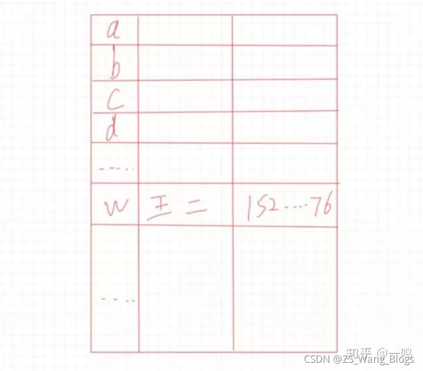
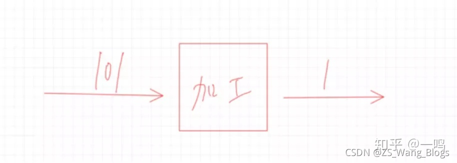
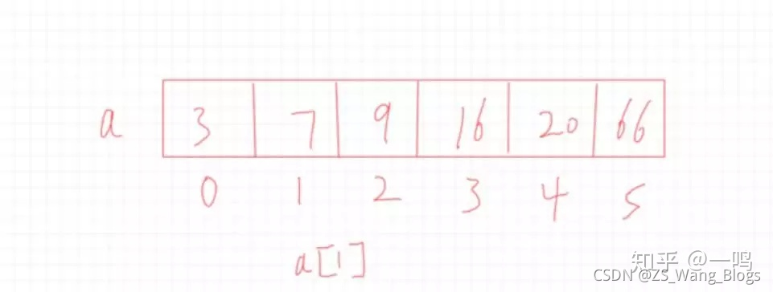
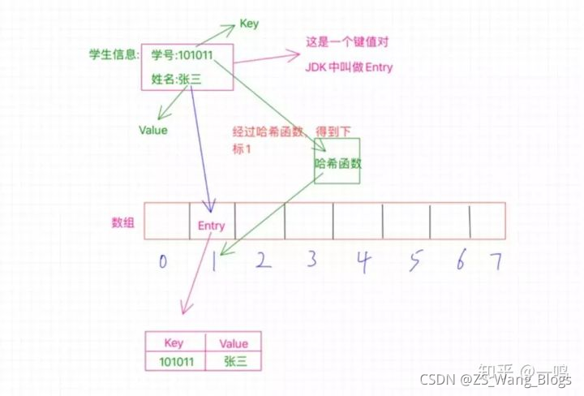
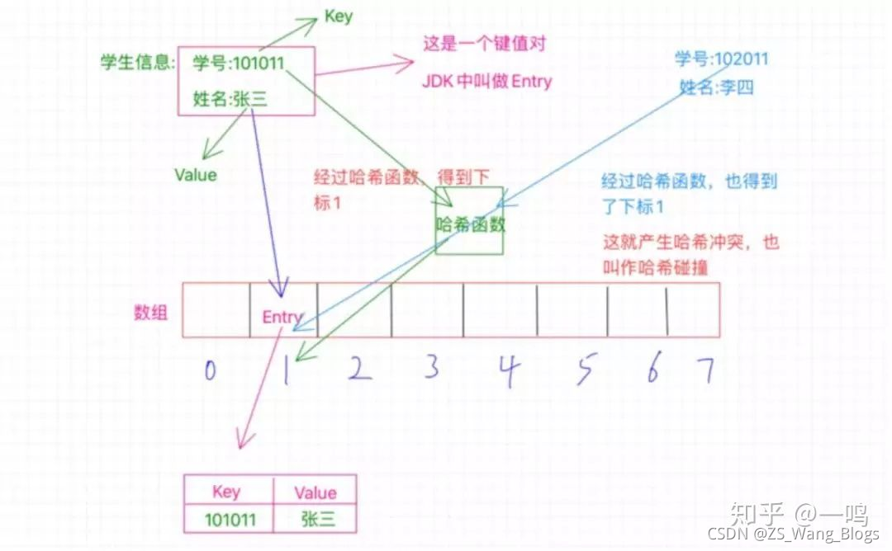
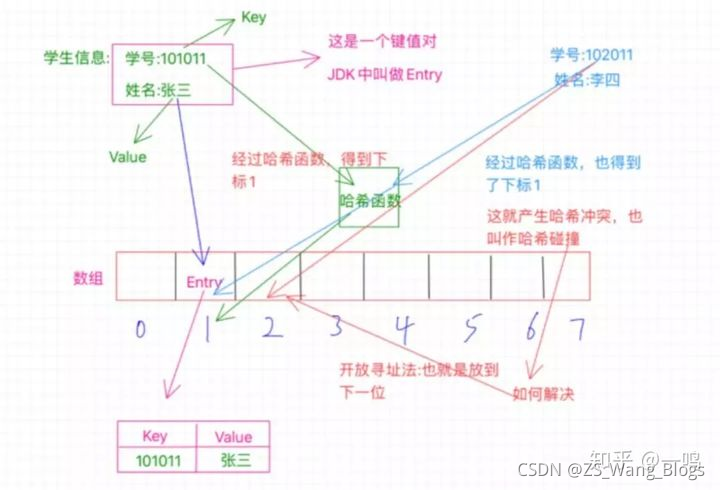
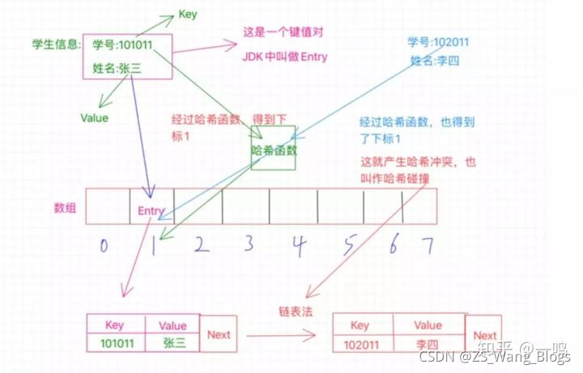
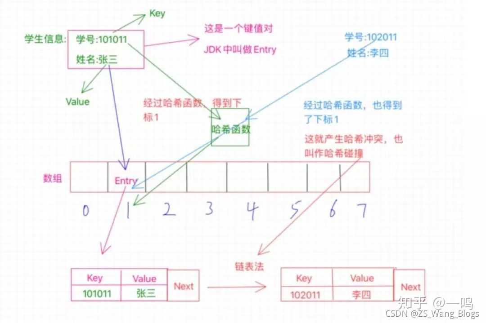
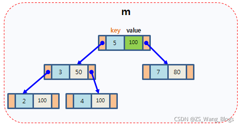
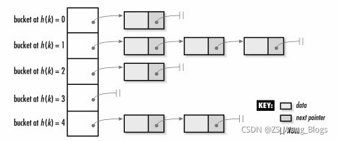

# C++ 哈希表

1. 什么是哈希表
2. map、hash_map、unordered_map的引入
3. unordered_map的用法

## 1. 什么是哈希表

#### 1.1 哈希表的定义

> “散列表（Hash table，也叫哈希表），是根据键（Key）而直接访问在内存存储位置的数据结构。也就是说，它通过计算一个关于键值的函数，将所需查询的数据映射到表中一个位置来访问记录，这加快了查找速度。这个映射函数称做散列函数，存放记录的数组称做散列表。

从上面的百度百科，我们小白可以知道3点：

- 哈希表也叫散列表
- 哈希表是一个数据结构
- 散列表是数组结构

并且大致能知道它是用来：**可以根据一个key值来直接访问数据，因此查找速度快**

说到访问数据，在最基本的几个数据结构中，数组肯定是查询效率是最高的。因为它可以直接通过数组下标来访问数据

`其实哈希表的本质上就是一个数组`，它之所以叫哈希表，只能说它的底层实现是用到了数组，稍微加工，自立门户成了哈希表

这么说，有点抽象，我们举一个例子

上面说到了“关键字”，“散列函数”，“散列表”，这些是什么意思

##### 哈希表的几个概念

**散列函数**
比如说，我现在给你个电话本，上面记录的有姓名和对应的手机号，我想让你帮我找王二的手机号是多少，那么你会怎么做呢？

你可能会说，那挨个找呗。

确实可以，那么你有没有想过，如果这个王二是在最后几页，那你去岂不是前面几页都白找了，有没有更快的方式呢？

是不是可以按照人名给分个类，比如按照首字母来排序，就abcd那样的顺序，这样根据王二我就知道去找w这些，这样不久快很多了

我们可以按照人名的首字母去弄一个表格，比如像这样：


我们取姓名的首字母作为一个标志，就可以很快的找到以这个字母开头的人名了，那么王二也就能更快的被我们找到，我们也不用再费力气去找什么张二和李二的，因为人家的名字首字母都不是w。

这里我们用到了一种方法：那就是取姓名的首字母做一个排序，那么这是不是就是通过一些特定的方法去得到一个特定的值，比如这里取人名的首字母，那么如果是放到数学中，是不是就是类似一个函数似的，给你一个值，经过某些加工得到另外一个值，就像这里的给你个人名，经过些许加工我们拿到首字母，**那么这个函数或者是这个方法在哈希表中就叫做散列函数**

画个图的话就是这个样子：


**关键值key**

这个也好理解啊，就像画的这个图，1是怎么得出来得，是不是根据未加工之前的101得出来的，这个加工过程其实就是个散列函数，而丢给它的这个101就是这个关键值啊，为啥叫它关键值嘞，那是因为我们要对它做加工才能得出我们想要的1啊，你说它关不关键

**哈希表**

所以说：**哈希表就是通过将关键值也就是key通过一个散列函数加工处理之后得到一个值，这个值就是数据存放的位置，我们就可以根据这个值快速的找到我们想要的数据**

#### 1.2 哈希表的存储方式

之前我们已经知道了哈希表的本质其实是个数组，数组有啥特点？
——下表从0开始，连续的，直接通过下标访问

有一个数组a，我们可以直接通过a[1]的形式来访问到数值7，所以查询效率很高。

那么哈希表本质上是个数组，那它跟这个类似吗？我们先来看个图


- 键值对：有一个key和一个value对应着，比如图中的101011是键值key，对应value张三，学生的学号和姓名就是一个键值对
- Entry：在java jdk里把键值对叫做Entry
- 在散列表中存储的是键值对

#### 1.3 哈希表如何存数据

看上面的图，我们已经知道了哈希表本质是个数组，所以这里有个数组，长度是8，现在我们要做的是把这个学生信息存放到哈希表中，也就是这个数组中去，那我们需要考虑怎么去存放呢？

这里的学号是个key，我们之前也知道了，哈希表就是根据key值来通过哈希函数计算得到一个值，这个值就是用来确定这个Entry要存放在哈希表中的位置的，实际上这个值就是一个下标值，来确定放在数组的哪个位置上。

比如这里的学号是101011，那么经过哈希函数的计算之后得到了1，这个1就是告诉我们应该把这个Entry放到哪个位置，这个1就是数组的确切位置的下标，也就是需要放在数组中下表为1的位置，如图中所示。

我们之前已经介绍过什么是Entry了，所以这里你要知道，`数组中1的位置存放的是一个Entry，它不是一个简单的单个数值，而是一个键值对，也就是存放了key和value`，key就是学号101011，value就是张三，我们经过哈希函数计算得出的1只是为了确定这个Entry该放在哪个位置而已。

现在我们就成功把这个Entry放到了哈希表中了

但有同学就会提出疑问：那就是这个哈希函数，是不是有一个特定的加工过程，比如可以经过某种计算把101011转换成1，那么有没有可能其他的学号经过哈希函数的计算也得出1呢？那这个时候是不是就撞衫啦

是的，这个撞衫确实会存在，称为哈希冲突

##### 1.3.1 哈希冲突

我们再来看下面这张图：

这种情况就像图中展示的那样，学号为102011的李四，他的学号经过哈希函数的计算也得出了1，那么也要放到数组中为1的位置，可是这个位置之前已经被张三占了啊，这怎么办？这种情况就是哈希冲突或者也叫哈希碰撞。

既然出现了这情况，不能不管李四啊，总得给他找个位置啊，怎么找呢？

**处理哈希冲突**
有两种主要的方法：一个是开放寻址法，一个是拉链法。

（1）开放寻址法


开放寻址法其实简单来说就是，既然位置被占了，那就另外再找个位置不就得了，怎么找其他的位置呢？这里其实也有很多的实现，我们说个最基本的就是既然当前位置被占用了，我们就看看该位置的后一个位置是否可用，也就是1的位置被占用了，我们就看看2的位置，如果没有被占用，那就放到这里呗，当然，也有可能2的位置也被占用了，那咱就继续往下找，看看3的位置，一次类推，直到找到空位置。

对了，Java中的ThreadLocal就是利用了开放寻址法。

关于开放寻址也有个疑问，那就是如果一直找不到空的位置咋整啊？

> 这个不会的，为啥嘞？你这样想，是因为你考虑了一个前提，那就是位置已经被占光了，没有空位置了，但是实际情况是位置不会被占光的，因为有一定量的位置被占了的时候就会发生扩容。

**哈希表的扩容**
不止是没有空位置需要扩容，当哈希表被占的位置比较多的时候，出现哈希冲突的概率也就变高了，所以很有必要进行扩容。

那么这个扩容是怎么扩的呢？这里一般会有一个增长因子的概念，也叫作负载因子，简单点说就是已经被占的位置与总位置的一个百分比，比如一共十个位置，现在已经占了七个位置，就触发了扩容机制，因为它的增长因子是0.7，也就是达到了总位置的百分之七十就需要扩容。

还拿HashMap来说，当它当前的容量占总容量的百分之七十五的时候就需要扩容了。

而且这个扩容也不是简单的把数组扩大，而是新创建一个数组是原来的2倍，然后把原数组的所有Entry都重新Hash一遍放到新的数组。

重新Hash就是：因为数组扩大了，所以一般哈希函数也会有变化，这里的Hash也就是把之前的数据通过新的哈希函数计算出新的位置来存放。

（2）拉链法
拉链法也是比较常用的，HashMap就是使用了这种方法

之前说的开放寻址法采用的方式是在数组上另外找个新位置，而拉链法则不同，还是在该位置，可是，该位置被占用了咋整，总不能打一架，谁赢是谁的吧 ，当然不是这样，这里采用的是链表，什么意思呢？就像图中所示，现在张三和李四都要放在1找个位置上，但是张三先来的，已经占了这个位置，待在了这个位置上了，那李四呢？解决办法就是`链表`，这时候这个1的位置存放的不单单是之前的那个Entry了，此时的Entry还额外的保存了一个`next指针`，这个指针指向数组外的另外一个位置，将李四安排在这里，然后张三那个Entry中的next指针就指向李四的这个位置，也就是保存的这个位置的内存地址，如果还有冲突，那就把又冲突的那个Entry放在一个新位置上，然后李四的Entry中的next指向它，这样就形成了一个链表。

> 如果冲突过多的话，这块的链表会变得比较长，怎么处理呢？这里举个例子吧，拿java集合类中的HashMap来说吧，如果这里的链表长度大于等于8的话，链表就会转换成树结构，当然如果长度小于等于6的话，就会还原链表。以此来解决链表过长导致的性能问题。

#### 1.3 哈希表如何存数据

#### 1.4 哈希表如何读取数据


比如我们现在要通过学号102011来查找学生的姓名，怎么操作呢？我们首先通过学号利用哈希函数得出位置1，然后我们就去位置1拿数据啊，拿到这个Entry之后我们得看看这个Entry的key是不是我们的学号102011，一看是101011，什么鬼，一边去，这不是我们要的key啊，然后根据这个Entry的next知道下一给位置，在比较key，好成功找到李四。

#### 1.5 哈希表的核心

现在我们对哈希表的讲解已经差不多了，那么对于哈希表而言，什么是核心呢？

```
哈希函数是核心
```

在哈希表中，哈希函数的设计很重要，一个好的哈希函数可以极大的提升性能，而且如果你的哈希函数设计的比较简单粗陋，那很容易被那些不怀好意的人捣乱，比如知道了你哈希函数的规则，故意制造容易冲突的key值，那就有意思了，你的哈希表就会一直撞啊，一直撞啊

**设计哈希函数有什么方法吗？**

有直接定址法，数字分析法，折叠法，随机数法和除留余数法等等（我们只做简单的了解，不深究）

1. 直接定址法：取关键字或关键字的某个线性函数值为哈希地址。
2. 数字分析法：假设关键字是以r为基的数（如：以10为基的十进制数），并且哈希表中可能出现的关键字都是事先知道的，则可取关键字的若干数位组成哈希地址。
3. 平方取中法：取关键字平方后的中间几位为哈希地址。
4. 斐波那契（Fibonacci）散列法
5. 折叠法：将关键字分割成位数相同的几部分（最后一部分的位数可以不同），然后取这几部分的叠加和（舍去进位）作为哈希地址，这方法称为折叠法。
6. 除留余数法：取关键字被某个不大于哈希表表长m的数p除后所得余数为哈希地址。即H(key)=key MOD p,(p<=m)，这是一种最简单，也是最常用的构造哈希函数的方法。它不仅可以对关键字直接取模（MOD），也可在折叠、平方取中等运算之后取模。
7. 随机数法：选择一个随机函数，取关键字的随机函数值为它的哈希地址，即H(key)=random(key)，其中random为随机函数。通常，当关键字长度不等时采用此法构造哈希函数较切当。

参考：[来吧！一文彻底搞定哈希表！](https://zhuanlan.zhihu.com/p/95156642)

## 2. map、hash_map、unordered_map的引入

#### 2.1 map

在介绍哈希表的标准库前，我们先提一下C++ STL库的map，map提供一个很常用的功能，那就是提供key-value的存储和查找功能，但是它内部实现机制是基于红黑树的。

map以模板(泛型)方式实现，可以存储任意类型的数据，包括使用者自定义的数据类型。Map主要用于资料一对一映射(one-to-one)的情況，map內部的实现自建一颗红黑树，这颗树具有对数据自动排序的功能。在map内部所有的数据都是有序的。比如一个班级中，每个学生的学号跟他的姓名就存在著一对一映射的关系。

map提供了一对一的映射关系，但是显然它的查找时间复杂度O(logN)的，对于数量庞大的数据来说，查找显然还是太慢了，上面介绍了哈希表的时间复杂度是O（1),而hash_map就是基于哈希表来实现的。

**C++ STL中常见容器的时间复杂度**：https://blog.csdn.net/wusecaiyun/article/details/46723363

#### 2.2 hash_map

前面在哈希表的介绍中，我们了解到，`“直接定址”与“解决冲突”是哈希表的两大特点。`

hash_map，首先分配一大片内存，形成许多桶。是利用hash函数，对key进行映射到不同区域（桶）进行保存。其插入过程是：

hash_map 其插入过程是：

1. 得到key
2. 通过hash函数得到hash值
3. 得到桶号(一般都为hash值对桶数求模)
4. 存放key和value在桶内。

其取值过程是:

1. 得到key
2. 通过hash函数得到hash值
3. 得到桶号(一般都为hash值对桶数求模)
4. 比较桶的内部元素是否与key相等，若都不相等，则没有找到。
5. 取出相等的记录的value。

hash_map中直接地址用hash函数生成，解决冲突，用比较函数解决。这里可以看出，如果每个桶内部只有一个元素，那么查找的时候只有一次比较。当许多桶内没有值时，许多查询就会更快了(指查不到的时候).

由此可见，要实现哈希表, 和用户相关的是：hash函数和比较函数。这两个参数刚好是我们在使用hash_map时需要指定的参数。

但是我们在初始化hash_map时，好像没有去制定hash函数和比较函数，原因是我们使用了缺省函数，自动帮我们设置了hash函数和比较函数

#### 2.3. unordered_map

实际上，最初的 C++ 标准库中没有类似 hash_map 的实现，但不同实现者自己提供了非标准的 hash_map。 因为这些实现不是遵循标准编写的，所以它们在功能和性能保证方面都有细微差别。

从 C++ 11 开始，hash_map 实现已被添加到标准库中。但为了防止与已开发的代码存在冲突，决定使用替代名称 unordered_map。这个名字其实更具描述性，因为它暗示了该类元素的无序性。

## 3. unordered_map的用法

参考：https://blog.csdn.net/lizhengze1117/article/details/96728468

#### 3.1.介绍

> c++的容器——unordered_map，它是一个关联容器，内部采用的是hash表结构，拥有快速检索的功能。

**特性：**

1. 关联性：通过key去检索value，而不是通过绝对地址（和顺序容器不同）
2. 无序性：使用hash表存储，内部无序
3. Map : 每个值对应一个键值
4. 键唯一性：不存在两个元素的键一样
5. 动态内存管理：使用内存管理模型来动态管理所需要的内存空间

**Hashtable和bucket**
由于unordered_map内部采用的hashtable的数据结构存储，所以，每个特定的key会通过一些特定的哈希运算映射到一个特定的位置，我们知道，hashtable是可能存在冲突的（多个key通过计算映射到同一个位置），在同一个位置的元素会按顺序链在后面。所以把这个位置称为一个bucket是十分形象的（像桶子一样，可以装多个元素）。


#### 3.2. 模版

unordered_map的官方定义

```cpp
template < class Key,                                    // unordered_map::key_type
           class T,                                      // unordered_map::mapped_type
           class Hash = hash<Key>,                       // unordered_map::hasher
           class Pred = equal_to<Key>,                   // unordered_map::key_equal
           class Alloc = allocator< pair<const Key,T> >  // unordered_map::allocator_type
           > class unordered_map;
```

主要使用的也是模板的前2个参数<键，值>（需要更多的介绍可以[点击这里](http://www.cplusplus.com/reference/unordered_map/unordered_map/)）

```cpp
unordered_map<const Key, T> map;
```

key值还可以是链表节点，即

```cpp
unordered_map<ListNode*，int>
```

#### 3.2.1 迭代器

unordered_map的迭代器是一个指针，指向这个元素，通过迭代器来取得它的值。

```cpp
unordered_map<Key,T>::iterator it;
(*it).first;             // the key value (of type Key)
(*it).second;            // the mapped value (of type T)
(*it);                   // the "element value" (of type pair<const Key,T>) 
```

**其中it->first返回的是key值，it->second返回的是value值**

例如：

```cpp
#include <iostream>
#include <string>
#include <unordered_map>
using namespace std;
int main()
{
    //创建 umap 容器
    unordered_map<string, string> umap{
        {"Python教程","http://c.biancheng.net/python/"},
        {"Java教程","http://c.biancheng.net/java/"},
        {"Linux教程","http://c.biancheng.net/linux/"} };
    cout << "umap 存储的键值对包括：" << endl;
    //遍历输出 umap 容器中所有的键值对
    for (auto iter = umap.begin(); iter != umap.end(); ++iter) {
        cout << "<" << iter->first << ", " << iter->second << ">" << endl;
    }
    //获取指向指定键值对的前向迭代器
    unordered_map<string, string>::iterator iter = umap.find("Java教程");
    cout <<"umap.find(\"Java教程\") = " << "<" << iter->first << ", " << iter->second << ">" << endl;
    return 0;
}
注意，遍历打印后是乱序的，unordered map是hash表。不是排序的。只有map是排序的，但是map打印也和构造的顺序不一样。
所以键值对的容器一般用来查找，而不是顺序存储
```

例如：

```cpp
    unordered_map<string,int>mymap = {{"hh",1},{"aa",2},{"ch",4},{"France",6},{"U.S.",8},{"AC.",10}};
    for(auto y = mymap.begin(); y != mymap.end(); ++y)
        cout<<y->first<<"  "<<y->second<<endl;
    cout<<endl;
    map<string,int>mymap_1 = {{"hh",1},{"aa",2},{"ch",4},{"France",6},{"U.S.",8},{"AC.",10}};
    for(auto x = mymap_1.begin(); x != mymap_1.end(); ++x)
        cout<<x->first<<"  "<<x->second<<endl;
```

打印：

> U.S. 8
> ch 4
> AC. 10
> aa 2
> France 6
> hh 1
>  
> AC. 10
> France 6
> U.S. 8
> aa 2
> ch 4
> hh 1

#### 3.3 功能函数

##### 3.3.1 构造函数

unordered_map的构造方式有几种：

- 构造空的容器
- 用数组构造
- 复制构造
- 范围构造

```cpp
unordered_map<int,int>hashmap_1;//构造空的容器
unordered_map<string,int>hashmap_2{{"Jan",44}, {"Jim", 33}, {"Joe", 99}};//直接构造
unordered_map<string,int>hashmap_3(hashmap_2);// 复制初始化
unordered_map<string,int>hashmap_4(hashmap_2.begin(),hashmap_2.end());// 范围初始化
```

还有一种是移动构造，不常用，感兴趣参考：http://c.biancheng.net/view/7231.html

```cpp
#include <iostream>
#include <string>
#include <unordered_map>
using namespace std;

typedef unordered_map<string,string> stringmap;

int main ()
{
  stringmap first;                              // 空
  stringmap second = {{"apple","red"},{"lemon","yellow"}};       // 用数组初始
  stringmap third = {{"orange","orange"},{"strawberry","red"}};  // 用数组初始
  stringmap fourth (second);                    // 复制初始化
  stringmap sixth (fifth.begin(),fifth.end());  // 范围初始化

  cout << "sixth contains:";
  for (auto& x: sixth) cout << " " << x.first << ":" << x.second;
  cout << endl;

  return 0;
}
```

输出结果：

> sixth contains: apple:red lemon:yellow orange:orange strawberry:red

备注：试了一下stringmap sixth (fifth.begin(),fifth.begin()+1);报错，好像只能从begin()到end(），疑惑先记着

##### 3.3.2 容量操作

（1）size

```cpp
//返回unordered_map容器中的元素数量。
mymap.size()
```

（2）max_size

```cpp
//返回unordered_map容器可以容纳的元素的最大数量。
mymap.max_size()
```

（3）bucket count

```cpp
//容器内部bucket的数量
mymap.bucket_count()
```

注意：一个bucket下面可能有多个元素

（4)empty

```cpp
//如果容器大小为0则返回true，否则返回false
mymap.empty()
```

（5）load_factor——负载因子

```cpp
//返回unordered_map容器中的当前负载因子。
unordered_map<string,string> mymap = {
        {"us","United States"},
        {"uk","United Kingdom"},
        {"fr","France"},
        {"de","Germany"}
};

cout<<mymap.load_factor()
```

结果为0.8

##### 3.3.3 元素操作

(1)find——查找元素

```cpp
//查找key所在的元素。
//- 找到：返回元素的迭代器。通过迭代器的first和second属性获取值
//- 没找到：返回unordered_map::end
string input = "mom";
unordered_map<string, double>::const_iterator got = mymap.find(input);
if(got == mymap.end())
    cout << "not found";
else
    cout << got->first << " is " << got->second;
```

（2）insert——插入元素

```cpp
unordered_map<string,double> myrecipe;
unordered_map<string,double> mypantry = {{"milk",2.0},{"flour",1.5}};
pair<string,double> myshopping ("baking powder",0.3);
myrecipe.insert (myshopping);                        // 复制插入
myrecipe.insert (make_pair<string,double>("eggs",6.0)); // 移动插入
myrecipe.insert (mypantry.begin(), mypantry.end());  // 范围插入
myrecipe.insert ({{"sugar",0.8},{"salt",0.1}});    // 初始化数组插入(可以用二维一次插入多个元素，也可以用一维插入一个元素)
myrecipe["coffee"] = 10.0;  //数组形式插入
```

（3）at ——查找key所对应的值

```cpp
//查找key所对应的值
//- 如果存在：返回key对应的值，可以直接修改，和[]操作一样。
//- 如果不存在：抛出 out_of_range 异常.
unordered_map<string,double> mypantry = {{"milk",2.1},{"flour",1.5}};
cout<<mypantry.at("milk");
```

结果打印2.1

（4）erase —— 擦除元素

```cpp
 unordered_map<int,int>mymap = {{1111,1},{1112,2},{1113,4},{1114,6},{1115,8},{1117,10}};print_map(mymap);
 mymap.erase(mymap.begin());print_map(mymap);
 mymap.erase(1112);print_map(mymap);
 mymap.erase(mymap.find(1114), mymap.end());print_map(mymap);
```

结果：

```cpp
1117  10
1115  8
1114  6
1113  4
1112  2
1111  1

1115  8
1114  6
1113  4
1112  2
1111  1

1115  8
1114  6
1113  4
1111  1

1115  8
```

（4）clear—— 清空元素

```cpp
mymap.clear();
    unordered_map<int,int>mymap = {{1111,1},{1112,2},{1113,4},{1114,6},{1115,8},{1117,10}};
    cout<<mymap.size()<<"  "<<mymap.max_size()<<"   "<<mymap.bucket_count()<<endl;    
    mymap.clear();
    cout<<mymap.size()<<"  "<<mymap.max_size()<<"   "<<mymap.bucket_count()<<endl;  
```

结果：

```cpp
6  576460752303423487   7
0  576460752303423487   7
```

（5）swap ——交换

```cpp
//交换两个unordered_map（注意，不是交换特定元素，是整个交换两个map中的所有元素）
mymap.swap(hemap);
```

（5）count——元素计数

```cpp
mymap.swap(k);
```

在容器中搜索键为k的元素，并返回找到的元素数量。因为unordered_map容器不允许重复的键，这意味着如果容器中存在具有该键的元素，**则该函数实际返回1，否则返回0。**