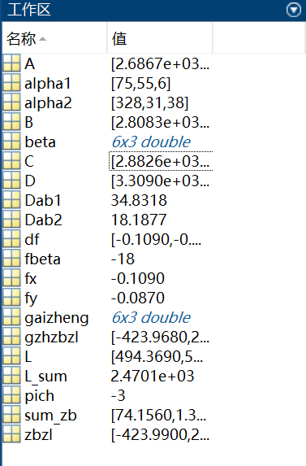

# MATLAB--导线测量

## 一.前言

在本文中，我将重点介绍如何利用MATLAB进行导线测量的计算。函数实现皆为自己所写，我也是初学者,对着流程一步步实现的,仅供学习。为了使导线测量更加用户友好，我尝试使用MATLAB的GUI工具来简化测量过程并提供更直观的结果展示。通过GUI界面，用户可以方便地输入坐标点、选择测量功能、查看测量结果等。然而，由于我是初学者，我的GUI设计可能并不够完美。如果有任何对GUI设计有经验的人愿意帮助我改进，我将非常感激并愿意倾听您的建议和经验。

导线测量是工程领域中的一项非常重要的技术，在测绘、建筑、电力等各个领域都有广泛的应用。本文将重点介绍一种基于MATLAB的导线测量方法，并逐步讲解实现过程，帮助初学者更好地理解和应用该方法。如果读者在本文中遇到了困难，可以参考我主页上传的资源，获取更多的帮助和支持。

在本文中，我将通过实例来介绍导线测量方法的具体实现。我将逐步介绍如何编写MATLAB程序，实现导线测量的各个步骤。我会提供充足的代码示例和注释，以帮助读者更好地理解和理解方法的核心原理。

## 二.程序展示

首先先看下程序的整体效果:

运行后的改正坐标增量


最后结果就是最后一列空白,比起手算还是很方便的


还有右方的内存区域:



这里博主为了省事,将需要的变量定义为了拼音缩写,比如zbzl为坐标增量的意思嘻嘻嘻。

## 三.代码解析

先提前解释下我所写的角之间计算的函数


```matlab
function result = calJiaojia(a,b)%计算角之间相加的函数
    if isnumeric(a) && isscalar(a)
        a=[a,0,0];
    end
    if isnumeric(b) && isscalar(b)
        b=[b,0,0];
    end
    jinwei=0;
    miao=a(3)+b(3);
    jinwei=fix(miao/60);
    if (miao>=60)
        miao=mod(miao,60);
    end
    fen=a(2)+b(2)+jinwei;
    jinwei=fix(fen/60);
    if (fen>=60)
        fen=mod(fen,60);
    end
    du=a(1)+b(1)+jinwei;
    result=[du,fen,miao];
```

细看就是正常的加法运算,它接受两个角度（用度、分、秒表示）作为参数，并返回它们相加的结果（也用度、分、秒表示）。

首先，将输入的角度 a 和 b 转换为标准格式：一个三元素的数组，分别表示角度的度数、分数和秒数。如果输入的角度不是标量或不是数字，会将其转换为度数为输入值，分数和秒数为 0 的标准格式。

然后，将两个角度的秒数之和计算出来，并检查是否超过了 60。如果超过了，需要将超出的部分进行进位加到分数上，并更新秒数为余数部分。

接着，将两个角度的分数之和计算出来，并检查是否超过了 60。如果超过了，需要将超出的部分进行进位加到度数上，并更新分数为余数部分。

最后，将两个角度的度数之和计算出来，并将度数、分数和秒数作为三个元素构成的数组返回作为函数的结果。

这个函数用于计算角度的数值相加，方便在需要进行角度加法运算的场景中使用。

同理减法运算:

```matlab
function result = calJiaojian(a,b)
    if isnumeric(a) && isscalar(a)
        a=[a,0,0];
    end
    if isnumeric(b) && isscalar(b)
        b=[b,0,0];
    end
    tempz=a(1)-b(1);
    if tempz>=0
        temp=a(3)-b(3);
        if temp<0
            a(2)=a(2)-1;
            a(3)=a(3)+60;
            miao=a(3)-b(3);
        else
            miao=temp;
        end
        temp=a(2)-b(2);
        if temp<0
            a(1)=a(1)-1;
            a(2)=a(2)+60;
            fen=a(2)-b(2);
        else
            fen=temp;
        end
            du=a(1)-b(1);
            result=[du,fen,miao];
    else
        result=calJiaojian(b,a);
    end
    
```

在此，我们需要先定义一些基本概念。在导线测量中，我们需要测量线段长度和线段之间的夹角。在计算的过程中，我们需要注意度数的表示方式以及长度单位的转换。在本例中，我们采用了角度的度分秒表示法，并将长度单位转换为米。

在给定已知点 A、B、C、D 和观测角及水平距离 beta、L 后

```matlab
% 已知点
A = [2686.681, 3744.191];
B = [2808.333, 4229.166];
C = [2882.598, 5574.768];
D = [3309.042, 5313.721];

% 输入观测角和水平距离
beta = [253, 08, 0; 156, 59, 36; 135, 11, 35; 145, 38, 10; 109, 41, 51; 171, 57, 02];
L = [494.369, 554.5062, 479.280, 482.258, 459.686];
L_sum = sum(L); % 距离和
```

这些就是测量的数据。没什么好说的

我们需要进行坐标反算。然后，我们可以计算观测角的方位角和后方交会计算。

```matlab
% 坐标反算
[Dab1, alpha1] = ZBFS(A(1), A(2), B(1), B(2));
[Dab2, alpha2] = ZBFS(C(1), C(2), D(1), D(2));
```

这里的ZBFS的函数实现就需要说下:
$$
设点 A 的坐标为 (xa, ya)，点 B 的坐标为 (xb, yb)，则点 A 与点 B 之间的距离 Dab 可以表示为：

Dab = sqrt((xb - xa)^2 + (yb - ya)^2)

设点 A 与点 B 之间的象限角为 aAB，则根据 deltax 和 deltay 的正负，坐标方位角 alpha 可以表示为：

如果 deltax > 0 且 deltay >= 0，则 alpha = aAB。

如果 deltax < 0 且 deltay >= 0，则 alpha = π - aAB。

如果 deltax < 0 且 deltay <= 0，则 alpha = π + aAB。

如果 deltax > 0 且 deltay <= 0，则 alpha = 2π - aAB。

如果 deltax = 0 且 deltay > 0，则 alpha = π/2。

如果 deltax = 0 且 deltay < 0，则 alpha = 3π/2。
$$


```matlab
function [Dab,alpha]=ZBFS(xa,ya,xb,yb)
%已知A、B两点的坐标，反求两点的方位角和距离
deltax=xb-xa;%x方向坐标增量
deltay=yb-ya;%y方向坐标增量
Dab=sqrt(deltax.*2+deltay.*2);%距离
aAB=atan2(abs(deltay),abs(deltax));%象限角
if deltax>0&&deltay>=0
    alpha=aAB;
elseif deltax<0&&deltay>=0
    alpha=pi-aAB;
elseif deltax<0&&deltay<=0
    alpha=pi+aAB;
elseif deltax>0&&deltay<=0
    alpha=2*pi-aAB;
elseif deltax==0&&deltay>=0
    alpha=pi./2;
else
    alpha=3*pi/2;
end
alpha=rad2deg(alpha);
end
```

这段程序用于实现坐标反算，即通过已知两点的坐标，反求两点之间的方位角和距离。

函数名为 ZBFS，参数为已知点 A 和 B 的坐标 (xa, ya, xb, yb)。

根据坐标增量计算了两点之间的距离 Dab。这里使用了勾股定理，即平方根(deltax^2 + deltay^2)。根据坐标增量的正负关系和各象限的角度定义，计算了方位角 alpha。根据坐标增量的不同情况，使用了不同的计算公式(这里测绘的应该懂)。最后，将方位角 alpha 转换为度数表示，并将方位角和距离作为函数的返回值。

通过这段程序，我们可以方便地根据已知点的坐标计算出两点之间的方位角和距离。

```matlab
% 四舍五入转换为度数，采用度分秒格式
alpha1 = round(degrees2dms(alpha1));
alpha2 = round(degrees2dms(alpha2));
```

这里没啥好说的。

算下理论值与实际值的差距

```matlab
% 计算fbeta
fbeta = fbeta(alpha1, beta, alpha2);

% 计算每段需要的误差中和值
pich = fbeta / length(beta);
```

计算函数fbeta:

公式很简单,就是理论值相加减去实际值
$$
fbeta=(alphab+beta1-180+beta2-180+...+betan-180)-alphacd
	 = (alphab+∑betai-n*180)-alphacd
$$


```matlab
function result = fbeta(a,b,c)%计算线差
    column_sums = sum(b);
    fir=calJiaojia(a,column_sums);
    sec=calJiaojian(fir,length(b)*180);
    if c(1)>=270 
    c=calJiaojian(360,c); 
    thi=calJiaojian(sec,c);
    result=-thi(3);
    else
    thi=calJiaojian(sec,c);
    result=thi(3);
    end
```

1. 首先，将参数b中的每列元素进行求和，赋值给变量column_sums。
2. 调用函数calJiaojia，将参数a和column_sums进行角度相加的计算，将结果赋值给fir。
3. 将参数b的长度乘以180，得到一个角度数值，然后调用函数calJiaojian，将fir和这个角度数值进行角度相减的计算，将结果赋值给sec。
4. 如果参数c的第一个元素大于等于270，执行以下步骤：
   - 调用函数calJiaojian，将360和参数c进行角度相减的计算，将结果赋值给c。
   - 调用函数calJiaojian，将sec和c进行角度相减的计算，将结果赋值给thi。
   - 将thi的第三个元素取负值，并将结果赋值给result。
5. 否则，执行以下步骤：
   - 调用函数calJiaojian，将sec和参数c进行角度相减的计算，将结果赋值给thi。
   - 将thi的第三个元素赋值给result。

最终，result就是计算得到的线差结果。

那么算出误差,我们就要消除,就要用gengzheng函数
$$
betai'=betai+(-fbeta/n)
$$
源码:

```matlab
function result=gengzheng(a,b,c)
    result=zeros(length(b),3);
    for i=1:length(b)
        temp = calJiao(a,b(i,:));
        temp(:, 3) = temp(:, 3) - c;
        a=temp;
        if temp(1)>0
           result(i,:)=temp;
        else
           result(i,:)=calJiaojia(360,temp);
        end
    end       
end
```

1. 首先，创建一个大小为b行数的全零矩阵，每行有3列，将其赋值给result变量。

2. 然后，使用一个循环来遍历b的每一行，循环变量i从1递增到b的长度。

3. 在循环内部，调用函数calJiao，将参数a和b的第i行作为输入，计算角度并将结果赋值给temp变量。

4. 将temp矩阵的第三列减去参数c，并将结果更新到temp矩阵中的第三列。

5. 将temp赋值给a，更新a的值。

6. 检查temp矩阵的第一个元素是否大于0。

   a. 如果是，将temp赋值给result的第i行。

   b. 如果不是，将temp矩阵传递给函数calJiaojia，与360进行角度相加的计算，并将结果赋值给result的第i行。

7. 循环结束后，返回结果矩阵result。

接着，我们可以通过计算角度和长度的平差值来计算所有点的坐标增量。就是坐标方位角那一列的改正后的值,本例子差了18秒的误差,也就是算加上18秒的误差后的坐标方位角。

```matlab
% 计算坐标增量的改正数
zbzl = zbzlg(L, gaizheng);
sum_zb = sum(zbzl);
```

```matlab
function [result,radians] = zbzlg(L, jiaodu)
    result = zeros(min(length(L), size(jiaodu, 1)), 2);

for i = 1:min(length(L), size(jiaodu, 1))
    radians = ((jiaodu(i,1) + (jiaodu(i, 2) / 60) + (jiaodu(i, 3) / 3600)) * (pi / 180));
    
    result(i, 1) = L(i) * cos(radians);  % 计算 x 坐标增量
    result(i, 2) = L(i) * sin(radians);  % 计算 y 坐标增量
end

result = round(result, 3);
end
```

```matlab
% 求闭合差
fx = B(1) + sum_zb(1) - C(1);
fy = B(2) + sum_zb(2) - C(2);
df = [fx, fy];
```

最后，我们还需要判断测量结果是否超限。在此等级我们以1/4000作为阈值。判断方法是计算所有点的坐标增量和，将其加到已知点 B 实际坐标中，并计算其与点 C 的距离，判断是否小于阈值。如果小于阈值，则输出“不超限”。


$$
[\frac{{\sqrt{{f_x^2 + f_y^2}}}}{{\sum L}} \leq \frac{1}{k}]
$$

```matlab
% 判断是否超限
if (sqrt(fx.^2 + fy.^2) / L_sum) <= 1 / 4000
    disp('不超限');
end
```

那么我们就求出改成后的坐标增量

```matlab
% 计算改正后的坐标增量
gzhzbzl = gaidf(zbzl, df, L)
```

$$
△xbi'=△xbi+[(-fx/∑L)]*Li
△ybi'=△ybi+[(-fy/∑L)]*Li
$$


```matlab
function result=gaidf(gz,df,L)
    result=zeros(length(gz),2);
    for i=1:length(gz)
        result(i,1)=gz(i,1)+(-df(1)/sum(L))*L(1);
        result(i,2)=gz(i,2)+(-df(2)/sum(L))*L(2);
        result=round(result,3);
    end
end
```

首先创建一个与 `gz` 矩阵长度相同的全零矩阵作为 `result`。循环遍历 `gz` 矩阵的每一行，并进行如下计算：

1. 通过将 `gz(i,1)` 加上 `(-df(1)/sum(L))*L(1)` 的结果赋值给 `result(i,1)`；
2. 通过将 `gz(i,2)` 加上 `(-df(2)/sum(L))*L(2)` 的结果赋值给 `result(i,2)`；
3. 使用 `round()` 函数将 `result` 矩阵的所有元素舍入到小数点后三位
4. 根据给定的 `gz`、`df` 和 `L` 计算并舍入结果，然后返回结果矩阵。

## 四.总结

导线测量在测绘领域中具有重要的应用价值。MATLAB作为一种强大的计算机软件工具，提供了丰富的功能和工具，可以帮助我们更高效、准确地进行导线测量分析和处理。

本博客介绍了使用MATLAB进行导线测量的基本流程和方法,通过使用MATLAB进行导线测量，我们可以极大地提高测量的效率和准确性。我们可以编写自定义的函数和脚本，根据特定的测量要求进行处理和分析。同时，MATLAB提供了丰富的绘图和数据可视化功能，可以帮助我们清晰地展示测量结果，以后或许会往这方面继续开发。

然而，在实际设计中，我们需要注意测量仪器的精确性和数据的可靠性。此外，还需要注意限差的判断。

重申，本程序仅供学习，gui还需改进，若想直接用程序，可以查看我上传的资源。
