# MATLAB数值与符号运算

## 一.多项式计算

### 1.表示方法

将多项式的降幂系数用行向量保存，则此行向量表示该多项式

例：x4 - 12x3 + 25x + 116

多项式p =[1 -12 0 25 116]

注意：多项式中缺项的系数0在行向量中必须写出！

### 2.求值——polyval与polyvalm

polyval函数
功能：用来求多项式的值
格式：Y=polyval(P,x)
说明：若x为一数值，则求多项式在该点的值，Y为一个数值
			若x为向量或矩阵，则对向量或矩阵中的每个元素求其多项式的值，
			Y为与x同维的向量或矩阵

```matlab
%例1已知多项式×4+8x3-10试计算当x分别为1.2和一个2×3矩阵时多项式的值
%构造表征多项式的行向量
A=[1,8,0,0,-10];
x=1.2;
%计算x=1.2时多项式值
y1=polyval(A,x)
x=[-1,1.2,-1.4;2,-1.8,1.6]
%计算x为矩阵时多项式值
y2=polyval(A,x)
```

```
y1 =

5.8976


x =

   -1.0000    1.2000   -1.4000
    2.0000   -1.8000    1.6000


y2 =

  -17.0000    5.8976  -28.1104
   70.0000  -46.1584   29.3216
```

polyvalm函数
功能:用来求矩阵多项式的值

格式:Y=polyvalm(P,A)

说明:A为方阵,P为表示多项式的行向量

​		Y为以方阵A为自变量的多项式的值

设A为方阵P代表多项式

polyvalm(P,A)的含义为:A*A*A - 5*A*A + 8*eye(size(A))*

polyval(P,A)的含义为:A.*A.*A-5*A.*A＋8*ones(size(A))

```
%构造表征多项式的行向量
A=[1,8,0,0,-10]
x=[-1,1.2;2,-1.8]
%两种方法计算多项式值
y1=polyval(A,x)
y2=polyvalm(A,x)
```

```
y1 =

  -17.0000    5.8976
   70.0000  -46.1584


y2 =

  -60.5840   50.6496
   84.4160  -94.3504
```

### 3、求根——roots

roots函数
功能:用来求多项式=0的方程的根
格式:r=roots(P)
说明:r为根列向量，即r(1),r(2),…,r(n)分别存储多项式P的n个根

### 4、求多项式的系数—poly

poly函数
功能:已知多项式=0的方程的根，反求多项式的系数格式:P=poly(r)
说明:Р为多项式降幂系数行向量

### 5、多项式系数转换为符号多项式—poly2sym

```
p =[1 2 1]
poly2sym(p)
sym2poly(ans)
```

```
ans =

x^2 + 2*x + 1


ans =

 1     2     1
```

### 6、多项式常用运算函数

多项式相乘——conv

```
a=[1 2 3] ; 
b=[1 2];
c=conv(a,b)
(𝑥2 + 2𝑥+ 3) ×(𝑥+ 2) = 𝑥3 + 4𝑥2 + 7𝑥+ 6
```

```
c =

 1     4     7     6
```

多项式相除——deconv

```
[q,r]=deconv(c,b)
```

```
q =％商多项式

 1     2     3


r =％余多项式

 0     0     0     0
```

多项式求导——polyder

```
a=[1 2 3];

p=polyder(a)%求多项式a的导函数
```

```
p =

 2     2
```

## 二.数据插值

### 1.一维数据插值

interp1函数

功能:用来对一维数据插值

格式:Y1=interp1(X,Y,X1,'method')

说明:根据X,Y的值，计算函数在X1处的值

X,Y是两个等长的已知向量，表示采样点和对应的函数值

X1是一个向量或标量，待求函数自变量的值,即待插值的点

Y1是一个与X1等长的函数应变量的值，即插值结果

method是插值方法，可为'linear'、'nearest'、'cubic’、'spline’

X1的取值范围不能超出X的范围，否则，会给出NaN错误

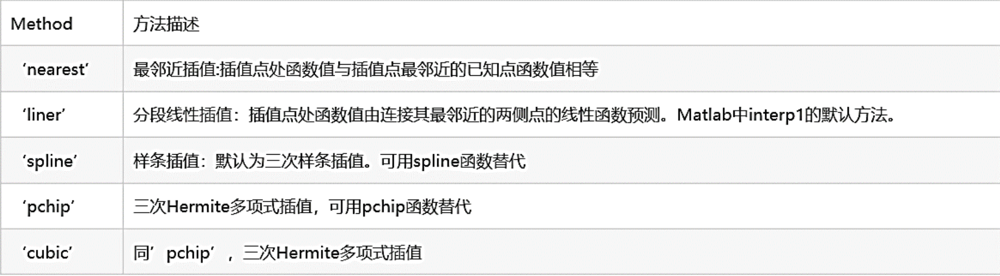

```
x=0.46:0.01:0.49;

y=[0.484,0.494,0.503,0.512];

y1=interp1(x,y,0.472)

y2=interp1(x,y,0.472,'nearest')
```

```
y1 =

0.4958


y2 =

0.4940
```

### 2.二维数据插值

#### interp2函数

功能:用来对二维数据插值
格式:Z1=interp2(X,Y,Z,X1,Y1,'method')
说明:根据X,Y,Z的值，计算函数在(X1,Y1)处的值
X,Y是两个已知向量，表示采样点
Z是与采样点对应的函数值
X1,Y1可以是向量或标量，表示待求函数自变量的值，即待插值的点Z1是根据相应的插值方法得到的插值结果
method取值与一维插值函数相同

X1,Y1的取值范围不能超出X,Y的范围，否则，会给出NaN错误

```
x=[0:2.5:10];
y=[0:30:60]';
z=[95,12,0,0,0;88,48,32,12,6;67,64,54,48,41];
xi=[0:0.5:10];
yi=[0:10:60]';
tmp=interp2(x,y,z,xi,yi,'cubic')
```

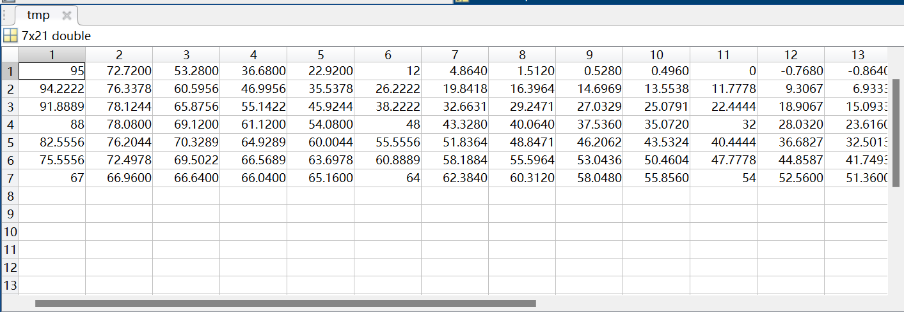

#### z=griddata (x,y,z,cx,cy, 'method')

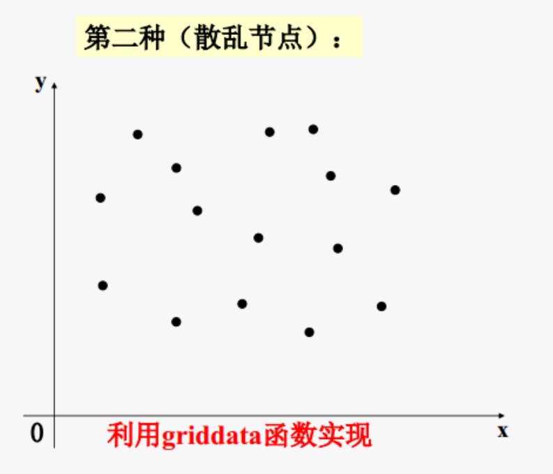

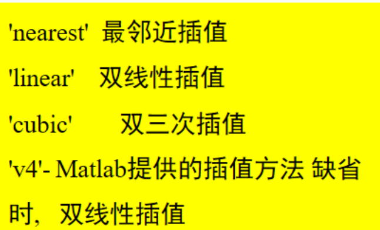

#### meshgrid函数

用于从数组a和b产生网格。生成的网格矩阵A和B大小是相同的。也可以是更高维的。

[A,B]=meshgrid:生成length(b)*length(a)大小的矩阵A和B*

它相当于a从一行重复增加到length(b)行，把b转置成一列再重复增加到length(a)列。

命令等效于：*(a,b)A=ones(size(b))*a;B=b'*ones(size(a))

```matlab
% 读取高程数据
elevation = [1130 1250 1280 1230 1040 900 500 700;
             1320 1450 1420 1400 1300 700 900 850;
             1390 1500 1500 1400 900 1100 1060 950;
             1500 1200 1100 1350 1450 1200 1150 1010;
             1500 1200 1100 1550 1600 1550 1380 1070;
             1500 1550 1600 1550 1600 1600 1600 1550;
             1480 1500 1550 1510 1430 1300 1200 980];
         
% 创建原始网格点
[X, Y] = meshgrid(1200:400:4000, 1200:400:3600);

% 创建插值用的新网格点
[Xq, Yq] = meshgrid(1200:50:4000, 1200:50:3600);

% 进行插值
spline_interp = interp2(X, Y, elevation, Xq, Yq, 'spline');
nearest_interp = interp2(X, Y, elevation, Xq, Yq, 'nearest');
linear_interp = interp2(X, Y, elevation, Xq, Yq, 'linear');
cubic_interp = interp2(X, Y, elevation, Xq, Yq, 'cubic');
makima_interp = interp2(X, Y, elevation, Xq, Yq, 'makima');

% 绘制三维图形
figure;
subplot(3, 2, 1);
meshc(X, Y, elevation);
title('最初数据');
subplot(3, 2, 2);
meshc(Xq, Yq, spline_interp);
title('样条插值');
subplot(3, 2, 3);
meshc(Xq, Yq, nearest_interp);
title('临近插值');
subplot(3, 2, 4);
meshc(Xq, Yq, linear_interp);
title('线性插值');
subplot(3, 2, 5);
meshc(Xq, Yq, cubic_interp);
title('分段三次插值');
subplot(3, 2, 6);
meshc(Xq, Yq, makima_interp);
title('Modified Akima 插值');
sgtitle('不同插值对比');
```

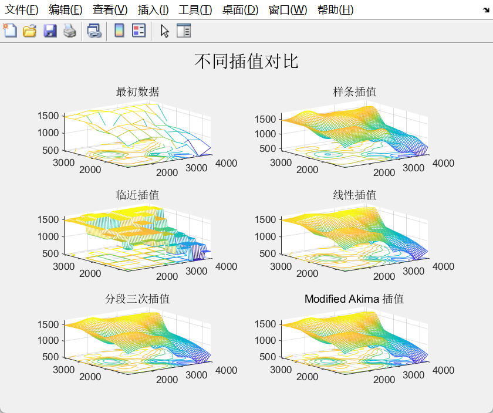

## 三.数据拟合

### 1、多项式拟合——polyfit

polyfit函数
功能:已知一组实验数据（采样点和对应函数值)，计算其拟合多项式
格式:[P,S]= polyfit (X,Y,m)
说明:X,Y为两个等长向量，是采样点及其对应的函数值
m为待求多项式的次数
P为所求的多项式系数向量，长度为m+1的向量
S为采样点的误差向量

```
x=0:0.1:1
y=[-0.447,1.978,3.28,6.16,7.08,7.34,7.66,9.56,9.48,9.3,11.2]
plot(x,y,'k.','markersize',25)
axis([0 1.3 -2 16])
p3=polyfit(x,y,3)
p6=polyfit(x,y,6)
t=-0.3:0.1:1.3;
s=polyval(p3,t);
s1=polyval(p6,t);
hold on
plot(t,s,'r-','linewidth',2)
plot(t,s1,'b--','linewidth',2)
grid on
```

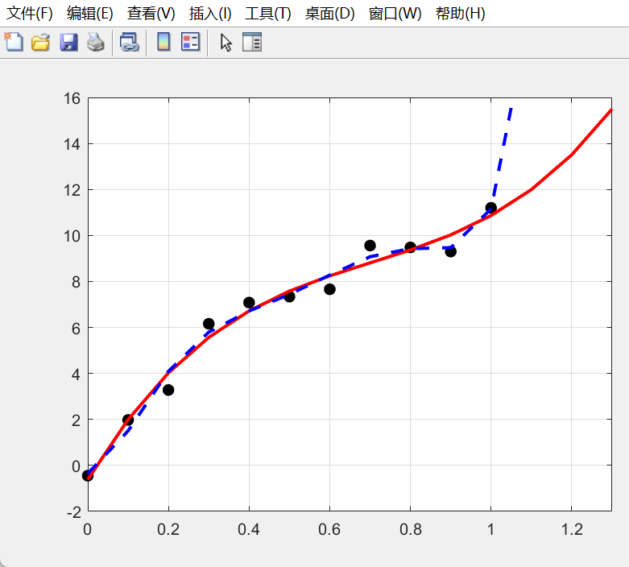

### 2、非线性拟合——lsqcurvefit

lsqcurvefit函数
功能:利用实验数据，按照给定的函数进行拟合，计算其拟合系数

格式:x = lsqcurvefit(fun, x0, xdata, ydata)
		[x, resnorm] = lsqcurvefit(fun, x0, xdata, ydata)

说明:根据给定的数据xdata, ydata(自变量,应变量)
按函数文件 fun给定的函数,以x0为初值作最小二乘拟合,返回函数fun中的系数向量x和残差平方和resnorm

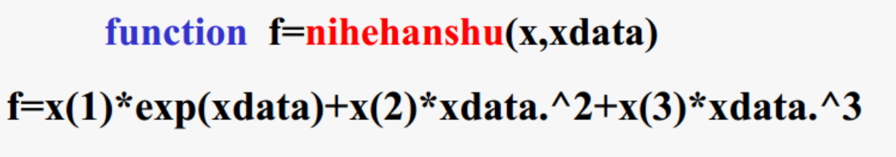

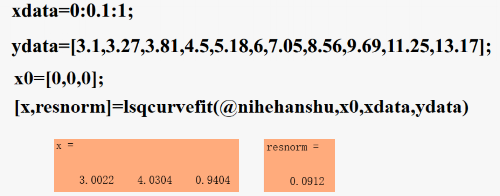

这里偷个懒

### 3.可视化拟合工具cftool

## 四.数值微积分

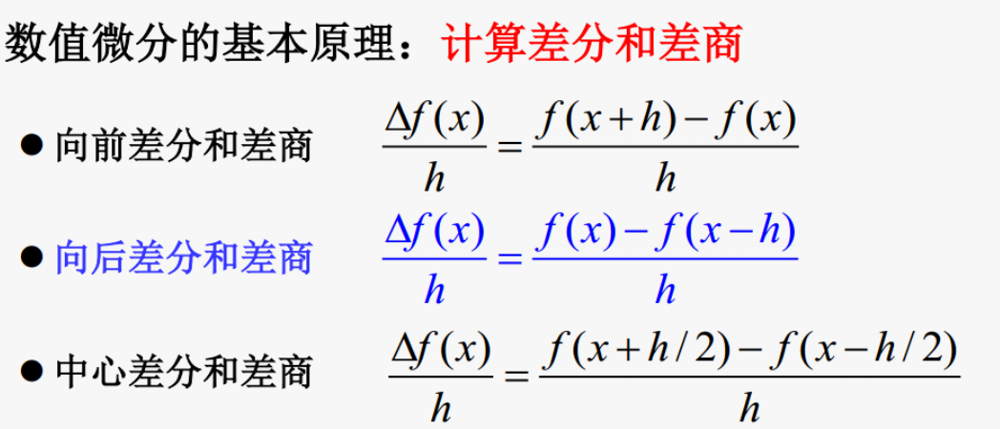

数值微分的实现

- 对向量X求向前差分:DX=diff(X)
- 对向量X求n阶向前差分:DX=diff(X,n)
- 对矩阵X求n阶向前差分:DX=diff(X,n,dim)

```
syms x
y1=sin(3*x+2);
y2=log(exp(3*x)+2);
y3=exp(3*x)*cos(x);
dy1=diff(y1,x)
dy2=diff(y2,x)
dy3=diff(y3,x)
```

```
dy1 =

3*cos(3*x + 2)


dy2 =

(3*exp(3*x))/(exp(3*x) + 2)


dy3 =

3*exp(3*x)*cos(x) - exp(3*x)*sin(x)
```

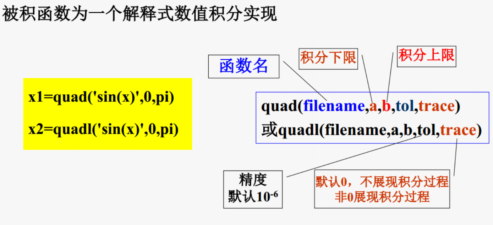

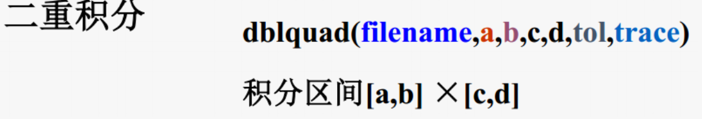

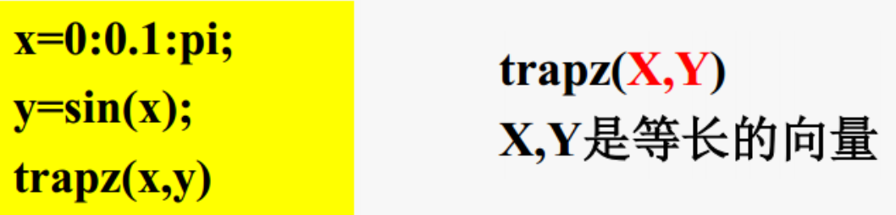

???????????

## 五.符号运算基础

- f='a*x^2+b*x+c'——多项式
- f2= 'a*x一2+b*x+c=O'——方程
- f3='Dy+y^2=1'——微分方程

### 1符号表达式——创建

●函数法sym
作用:用来建立单个符号量
格式:符号变量名=sym('表达式')
说明:表达式可以为字符、字符串、数学表达式或字符表达式
例:a=sym('a')
建立符号变量a
则用户可以在表达式中使用变量a进行各种运算

- pi1=sym('pi');k1=sym('8');
- k2=sym('2');k3=sym('3');%定义符号变量
- pi2=pi;r1=8;r2=2;r3=3;%定义数值变量
- sin(pi1/3)%计算符号表达式值3^(1/2)/2
- sin(pi2/3)%计算数值表达式值0.8660
- sqrt(k1)%计算符号表达式值2*2~(1/2)
- sqrt(r1)%计算数值表达式值2.8284
- sqrt(k3+sqrt(k2))%计算符号表达式值(1/2) + 3)^(1/2)
- sqrt(r3+sqrt(r2))%计算数值表达式值2.1010

函数法syms
作用:用来一次建立多个符号量
格式:符号变量名=syms var 1 var2 ....varn
		%定义符号变量var1,var2..,varn等

说明:变量间用空格分隔

### 2.运算

- 四则运算
- 构建复合函数
- 求反函数
- 因式分解与展开表达式化简

### 3.符号表达式构建复合函数

方法:用compose(f,g)返回复合函数f(g(x))
例∶

```
f=sym('sin(u) ');

g=sym('x^2');

compose(f,g)

compose(g,f)

```

### 4.符号表达式——求反函数

方法:利用finverse(f)返回f的反函数
f =sym('-3/2+1/2*x')
f1=finverse(f)

### 5.符号表达式——因式分解与展开

- factor(S) :对s分解因式，即:把多项式转换为乘积形式
- expand(S):对s进行展开，即:将乘积展开为和式
- collect(S) :对s合并同类项
- collect(S,v):对S按变量v合并同类项

### 6.符号表达式——表达式化简

相关函数有:
simplify(S)
用函数规则对S进行化简。即利用各种恒等式化简代数式

### 7.符号表达式——转换

符号表达式转换为数值表达式
格式eval(f)即求符号表达式的数值

### 8.符号表达式——转换

数值表达式转换为符号表达式

### 9.符号矩阵--创建

格式sym(f)

用sym创建符号矩阵格式:A=sym('[ ]')
符号矩阵内容同数值矩阵需用sym指令定义
需用''标识