# MATLAB矩阵运算

## 一.MATLAB矩阵表示方法

### 1、矩阵表现形式

- 标量（单个数值）：看作为仅含一个元素的矩阵
- 列向量：只有一列的矩阵
- 矢量（行向量）：只有一行的矩阵
- 一般的m×n矩阵
- 矩阵元素可以是一个数据，也可以是一个表达式

### 2、矩阵的语句生成方法

#### 1：利用冒号表达式生成线性等距向量

格式：start:step:end

```
x=1:6
y=1:2:6
z=6:-2:1
```

```
x =

 1     2     3     4     5     6


y =

 1     3     5


z =

 6     4     2
```

#### 2：linspace命令

在线性空间上，行矢量的值从a到b，数据个数为n，缺省n为100，格式：A=linspace(a,b,n) ，与a:(b-a)/(n-1):b等价.

```
y=linspace(1,100,10)

y =

 1    12    23    34    45    56    67    78    89   100
```

若不填写参数,默认生成100个数

#### 3:利用MATLAB函数建立矩阵

- eye:单位矩阵

- zeros:全部元素都为0的矩阵

- ones:全部元素都为1的矩阵

- rand:0-1间均匀分布的随机矩阵

- randn:产生标准正态分布矩阵

- 空阵[]:操作无结果时，返回空阵.

  格式：

  zeros(m)：产生m×m零矩阵

  eye(m,n) ：产生m×n单位矩阵

  rand(size(A))：产生与矩阵A同样大小的随机矩阵

  ```
  x=zeros(2)
  
  x =
  
   0     0
   0     0
  ```

  ```
  x=ones(3)
  
  x =
  
   1     1     1
   1     1     1
   1     1     1
  ```

生成一个4*3的随机数矩阵，元素在60-100之间。

```
x=60+(100-60)*rand(4,3)

x =

   92.5889   85.2944   98.3003
   96.2317   63.9016   98.5955
   65.0795   71.1399   66.3045
   96.5350   81.8753   98.8237
```

#### 4：利用已知小矩阵或者向量建立大矩阵

```
A=[1 2 3;4 5 6;7 8 9]
C=[A;eye(size(A));ones(size(A))]

C =

 1     2     3
 4     5     6
 7     8     9
 1     0     0
 0     1     0
 0     0     1
 1     1     1
 1     1     1
 1     1     1
```

### 3、矩阵消除子块

将矩阵的子块赋值为空矩阵[ ]，则相当于消除了相应的矩阵子块.

```
A=[1 2 3 4;5 6 7 8;9 10 11 12]
A(1:2,:)=[]

A =

 9    10    11    12
```

### 4、矩阵扩展

对矩阵中一个不存在的地址进行赋值，该矩阵会自动扩展行列数，并在该位置上添加这个数，且在其他没有指定的位置补零.

```
A=[1 2 3 4;5 6 7 8;9 10 11 12];
A(1,6)=100;
disp(A)

1     2     3     4     0   100
5     6     7     8     0     0
9    10    11    12     0     0
```

### 5、矩阵合并

对函数进行合并操作

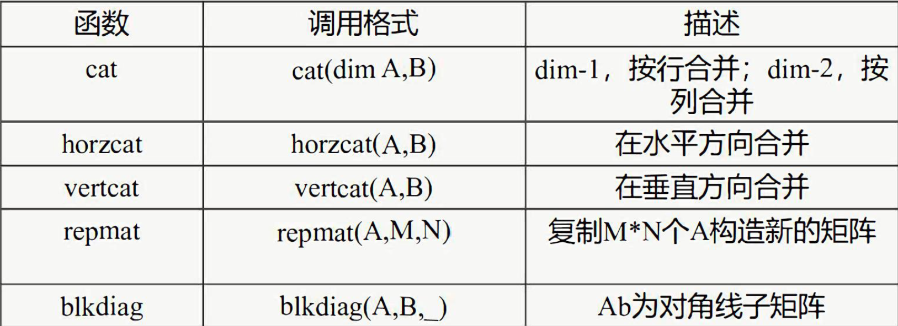

```
A=[1 2 3;5 6 7];
B=[11 12 13;14 15 16;17 18 19];
C=[21 22 23;24 25 26];
X1=cat(1,A,B)
X2=cat(2,A,C)
X3=horzcat(A,C)
X4=vertcat(A,B)

X1 =

 1     2     3
 5     6     7
11    12    13
14    15    16
17    18    19


X2 =

 1     2     3    21    22    23
 5     6     7    24    25    26


X3 =

 1     2     3    21    22    23
 5     6     7    24    25    26


X4 =

 1     2     3
 5     6     7
11    12    13
14    15    16
17    18    19
```

```
A=[1 2 3;5 6 7]
B=[11 12 13;14 15 16;17 18 19]
X1=repmat(B,2,3)
X2=blkdiag(A,B)

X1 =

11    12    13    11    12    13    11    12    13
14    15    16    14    15    16    14    15    16
17    18    19    17    18    19    17    18    19
11    12    13    11    12    13    11    12    13
14    15    16    14    15    16    14    15    16
17    18    19    17    18    19    17    18    19


X2 =

 1     2     3     0     0     0
 5     6     7     0     0     0
 0     0     0    11    12    13
 0     0     0    14    15    16
 0     0     0    17    18    19
```

## 二.MATLAB矩阵元素的引用与计算

### 1、矩阵元素的引用

- 方法1：利用下标来引用A(i,j)，i为行号、j为列号
- 方法2：利用序号来引用A(i),i为元素的存储序号m×n，矩阵元素A(i,j)的序号为(j-1)*m+i

```
A=[1 2 3;5 6 7];
a=A(2,3),A(6)

a =

 7


ans =

 7
```

### 2、矩阵元素的修改

- 直接修改：可用工作空间进行修改
- 指令修改：可以用A(*,*) =*来修改

```
A=[1 2 3;5 6 7];
A(2,3)=0  

A =

 1     2     3
 5     6     0
```

### 3、求矩阵的最大元素与最小元素

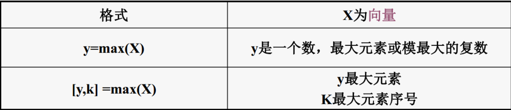

```
A=[1 2 3 5 6 7 6 3 4];
a1=max(A)
[a1,keyboard]=max(A)

a1 =

 7


a1 =

 7


keyboard =

 6
```

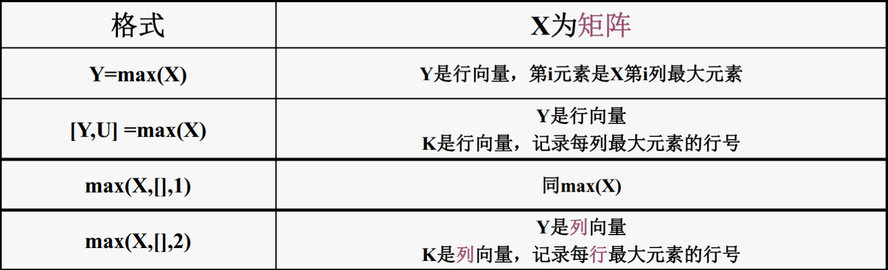

```
a=[1 2 3;4 5 6;7 8 9];
A1=max(a),
[A2,k1]=max(a),
B1=max(a,[],1),
B2=max(a,[],2),
[c1,k]=min(a,[],1),

A1 =

 7     8     9


A2 =

 7     8     9


k1 =

 3     3     3


B1 =

 7     8     9


B2 =

 3
 6
 9


c1 =

 1     2     3
```

### 4、矩阵元素的比较

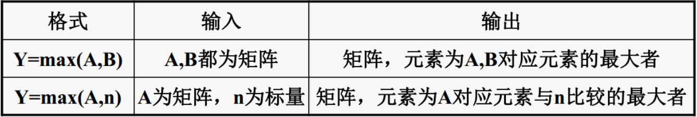

```
a=[1 2 3;4 5 6;7 8 9];
b=[4 5 6;7 8 9;1 2 3];
A1=max(a,b),
B1=max(a,5),
B2=min(b,5),

A1 =

 4     5     6
 7     8     9
 7     8     9


B1 =

 5     5     5
 5     5     6
 7     8     9


B2 =

 4     5     5
 5     5     5
 1     2     3
```

### 5、矩阵元素的计算

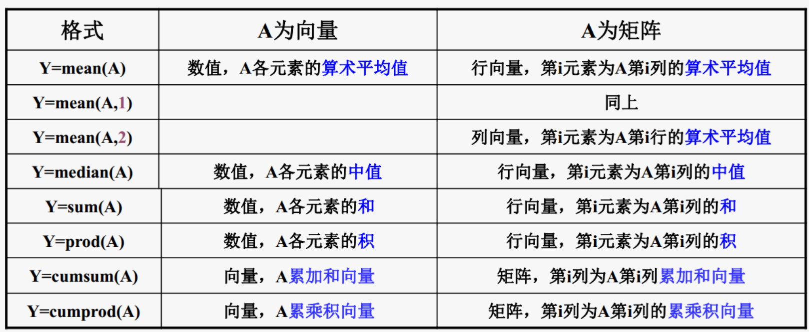

```
a=[1 2 6;4 5 9;10 11 15];
A1=mean(a),
A2=mean(a,2),
A3=median(a),
A4=sum(a),
A5=sum(a,2),
A6=prod(a)
A7=cumsum(a),
a8=cumprod(a),

A1 =

 5     6    10


A2 =

 3
 6
12


A3 =

 4     5     9


A4 =

15    18    30


A5 =

 9
18
36


A6 =

40   110   810


A7 =

 1     2     6
 5     7    15
15    18    30


a8 =

 1     2     6
 4    10    54
40   110   810
```

### 6、矩阵元素的排序

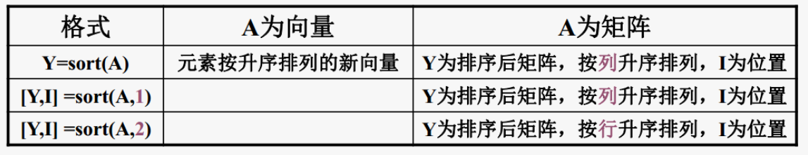

```
a=[1 2 6 4 5 9 11 10 15 33 6]
A=[1 2 6;4 5 9;10 11 15;3 3 6]
A1=sort(a),
[A2,I2]=sort(A),
[A3,I3]=sort(A,1),
[A4,I4]=sort(A,2),

a =

 1     2     6     4     5     9    11    10    15    33     6


A =

 1     2     6
 4     5     9
10    11    15
 3     3     6


A1 =

 1     2     4     5     6     6     9    10    11    15    33


A2 =

 1     2     6
 3     3     6
 4     5     9
10    11    15


I2 =

 1     1     1
 4     4     4
 2     2     2
 3     3     3


A3 =

 1     2     6
 3     3     6
 4     5     9
10    11    15


I3 =

 1     1     1
 4     4     4
 2     2     2
 3     3     3


A4 =

 1     2     6
 4     5     9
10    11    15
 3     3     6


I4 =

 1     2     3
 1     2     3
 1     2     3
 1     2     3
```

### 7、求标准方差

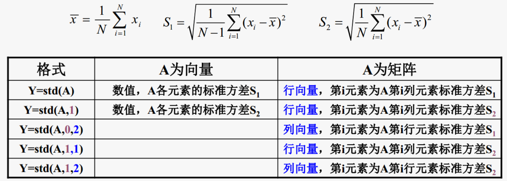

### 8、求相关系数

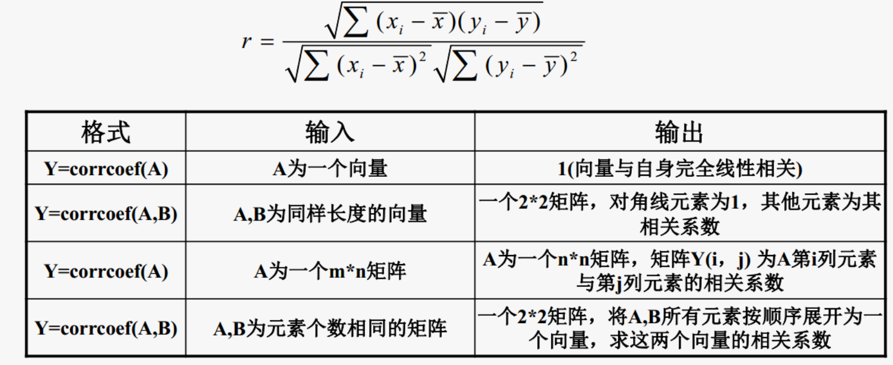

## 三.MATLAB矩阵运算

### 1、矩阵运算说明

- 维数相同的矩阵才能进行加减运算，当两个矩阵中前个矩阵的列数和后个矩阵的行数相同才可以进行乘法运算
- a\b运算等效于求a*x=b的解，相当于inv(a)*b；而a/b等效于求x*a=b的解，相当于b*inv(a)
- 只有方阵才可以求幂
- 点运算是两个维数相同矩阵对应元素之间的运算+；-；*；\和/；^；.*；.\；./；.^

### 2、矩阵四则运算

```matlab
a=[1 2;3 4]
b=[3 6;9 16]
c=a+b
d=a-b
A1=a*b
A2=a/b
A3=a\b
A4=a^3
A5=a.*b
A6=a./b
A7=a.\b
A8=a.^3

a =

 1     2
 3     4


b =

 3     6
 9    16


c =

 4     8
12    20


d =

-2    -4
-6   -12


A1 =

21    38
45    82


A2 =

0.3333    0.0000

   -2.0000    1.0000


A3 =

3.0000    4.0000
0.0000    1.0000


A4 =

37    54
81   118


A5 =

 3    12
27    64


A6 =

0.3333    0.3333
0.3333    0.2500


A7 =

 3     3
 3     4


A8 =

 1     8
27    64
```

### 3、矩阵运算函数

- size(a)：求矩阵大小
- length(a)：求矩阵行列数最大值
- inv(A):求逆(A为方阵)
- det(A):求行列式(A为方阵)
- rank(A):求矩阵的秩
- eig(A)：求矩阵特征值与特征向量

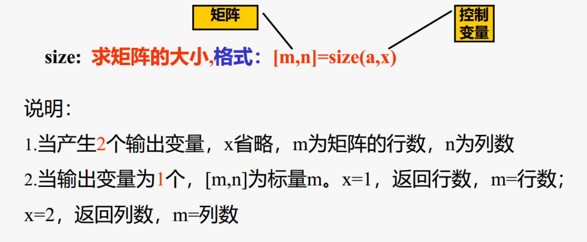

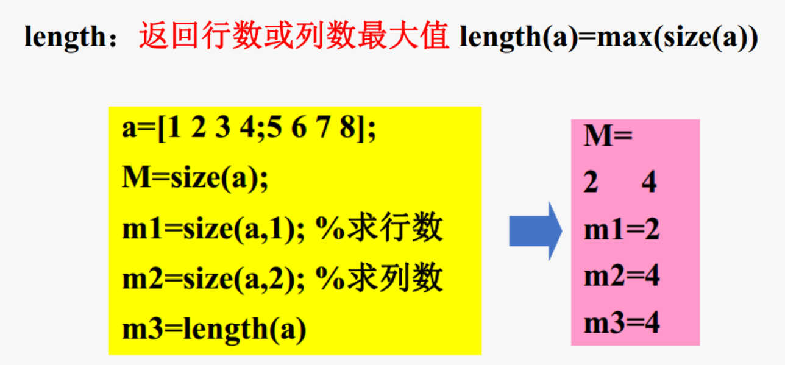

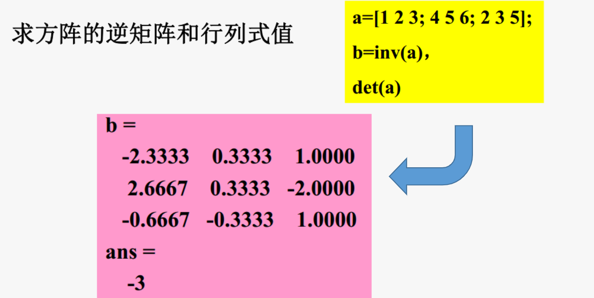

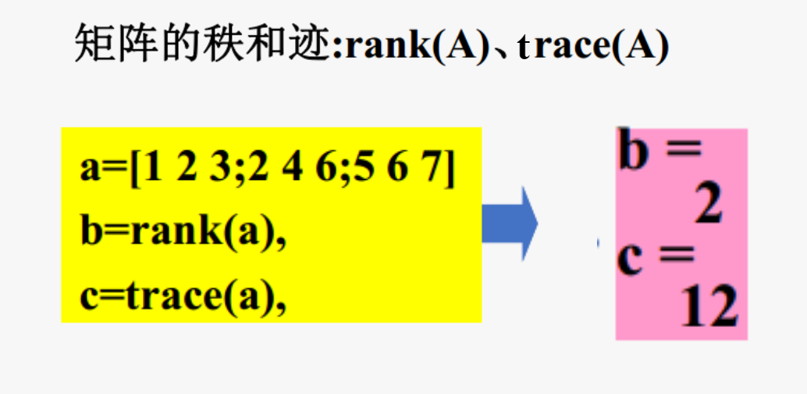

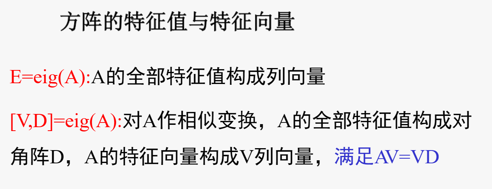

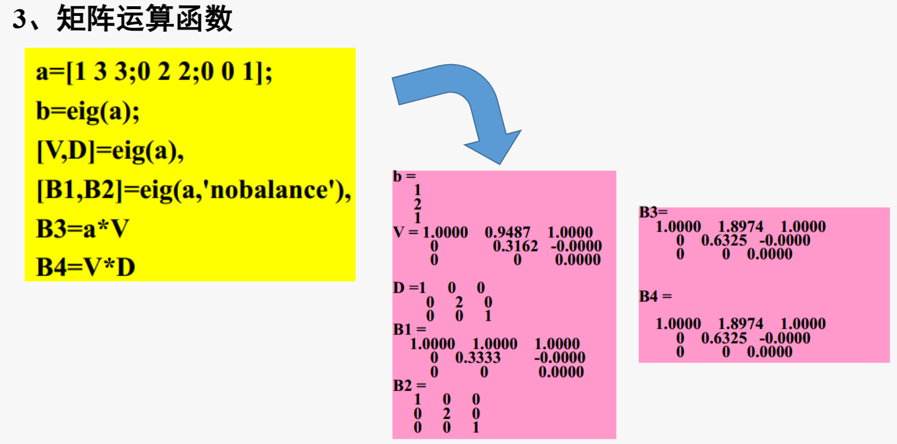

### 4、关于矩阵元素的运算函数

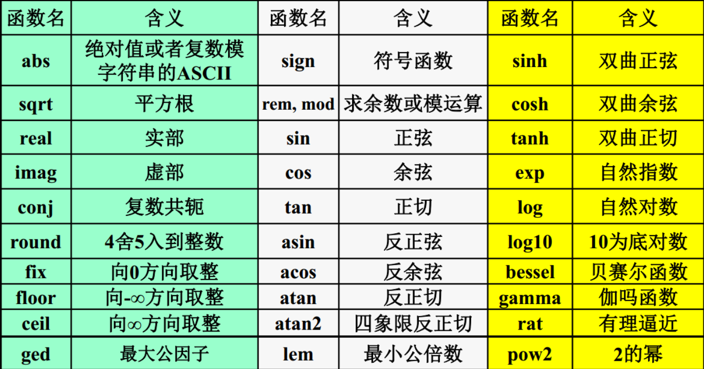

求余rem与mod 函数

当x和y的正负号一样的时候，两个函数结果是等同的；

当x和y的符号不同时，rem函数结果的符号和x的一样，而mod和y一样。

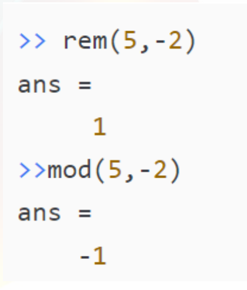

## MATLAB关系运算与逻辑运算

### 1、关系运算

#### (1)关系运算符

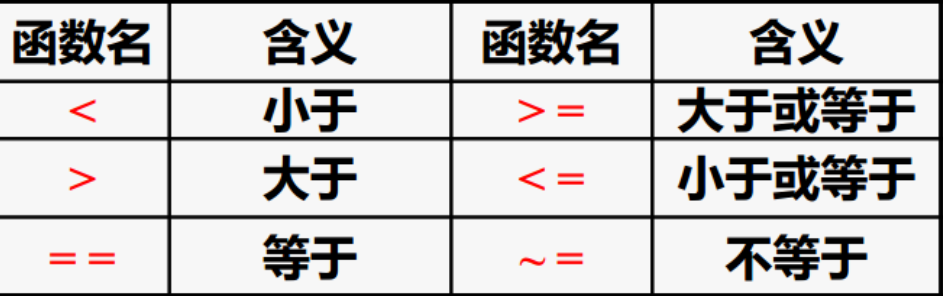

(2)关系运算规则
>- 表达式结果真为1，假为0>比较两个标量，直接比较大小
>- 比较维数相同的矩阵，比较对应元素的大小，结果由0，1组成的维数相同的矩阵
>- 比较的是标量与矩阵，将标量与矩阵每个元素比较,结果是一个由0，1组成的与矩阵维数相同的矩阵
>- =含义是赋值，==是关系运算

```
A=1:9,
B=9-A;
tf1=A>=4,
tf2=A>4,
tf3=B~= 4,

tf1 =

  1×9 logical 数组

   0   0   0   1   1   1   1   1   1


tf2 =

  1×9 logical 数组

   0   0   0   0   1   1   1   1   1


tf3 =

  1×9 logical 数组

   1   1   1   1   0   1   1   1   1


```

### 2、逻辑运算

(1)逻辑运算符:&(与)、((或)、~(非)

>a&b: a、b全为非零，运算结果为1
>
>a|b: a、b只要一个为非零，运算结果为1
>
>~a: a为零，运算结果为1

(2)逻辑运算规则
>确认非零元素为真，用1表示，零元素为假，用0表示;
>如参与逻辑运算的是维数相同的矩阵,运算的对象是对应元素,结果是由0，1组成的矩阵;
>如参与逻辑运算的是标量与矩阵，运算对象是标量与矩阵每个元素,结果是由0，1组成的矩阵;
>运算级别:算术运算>关系预算>逻辑运算。

```
A=[1 2 3 4 5 6 7 8 9];
c1=~(A>4),
c2=(A>4)&(A<7),

c1 =

  1×9 logical 数组

   1   1   1   1   0   0   0   0   0


c2 =

  1×9 logical 数组

   0   0   0   0   1   1   0   0   0
```

### 3.逻辑运算函数

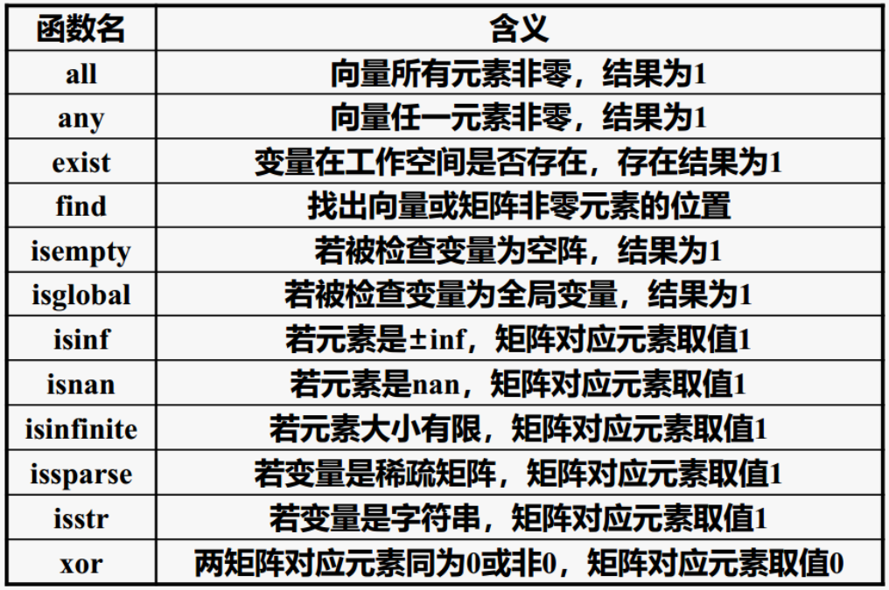

```
A=[0 1 2 3 4 5 6 7 8 9];
B=[0 0 2 3 4 5 6 7 8 9];
c1=all(A),
c2=find(A),
c3=xor(A,B),

c1 =

  logical

   0


c2 =

 2     3     4     5     6     7     8     9    10


c3 =

  1×10 logical 数组

   0   1   0   0   0   0   0   0   0   0
```

## MATLAB矩阵变换

### 1、矩阵转置

- 两种方式'和.' ，实矩阵转置结果一样；
- 含复数的矩阵，则'将同时对复数进行共轭处理；而.'将其排列形式进行转置.

```
a=[1 2 3;4 5 6];
b=a',
c=a.',
b=[1+2i 2-7i]',
b1=[1+2i 2-7i].',

b =

 1     4
 2     5
 3     6


c =

 1     4
 2     5
 3     6


b =

   1.0000 - 2.0000i
   2.0000 + 7.0000i


b1 =

   1.0000 + 2.0000i
   2.0000 - 7.0000i
```

### 2、矩阵旋转

rot90(A,k)：将矩阵A逆时针旋转90*k度

```
a=[1 2 3;4 5 6];
A1=rot90(a),
A2=rot90(a,2),
A3=rot90(a,3),
A4=rot90(a,3),
A5=rot90(a,4)

A1 =

 3     6
 2     5
 1     4


A2 =

 6     5     4
 3     2     1


A3 =

 4     1
 5     2
 6     3


A4 =

 4     1
 5     2
 6     3


A5 =

 1     2     3
 4     5     6
```

### 3、矩阵翻转

- fliplr(A):左右翻转
- flipud(A): 上下翻转

```
a=[1 2 3;0 0 0;4 5 6];
A1=fliplr(a),
A2=flipud(a),

A1 =

 3     2     1
 0     0     0
 6     5     4


A2 =

 4     5     6
 0     0     0
 1     2     3
```

### 4、构建对角矩阵

diag函数: diag(A,k)
>A为矩阵，提取主对角线元素，结果为一个向量
>A为向量，以此作为主对角线元素建立一个矩阵
>k为对角线顺序，主对角线第0，往上为1,2,3，往下-1,-2,-3

```
a=[1 2 3 4;5 6 7 8;9 10 11 12];
A1=diag(a),
A2=diag(a,2),
A3=diag(a,-1),
A4=diag(a(:,2))%第2列作为主对角线
A5=diag(a(1,:),-2)%第1行作为-2条对角线

A1 =

 1
 6
11


A2 =

 3
 8


A3 =

 5
10


A4 =

 2     0     0
 0     6     0
 0     0    10


A5 =

 0     0     0     0     0     0
 0     0     0     0     0     0
 1     0     0     0     0     0
 0     2     0     0     0     0
 0     0     3     0     0     0
 0     0     0     4     0     0


```

### 5、对角矩阵的应用

对角矩阵左乘，相当于第一个元素乘于第一行，第二个元素乘于第二行

矩阵右乘对角矩阵，相当于第一元素乘于第一列，第二个元素乘于第二列

### 6、三角阵

> 上三角triu(A,k)，A为矩阵，结果为一个第k条对角线以上与A相同的矩阵
>
> 下三角tril(A,k)，A为矩阵，结果为一个第k条对角线以下与A相同的矩阵

```
a=[1 2 3 4;5 6 7 8;9 10 11 12];
A1=triu(a),
A2=triu(a,2),
A3=tril(a),
A4=tril(a,-1),
A5=tril(a,2),

A1 =

 1     2     3     4
 0     6     7     8
 0     0    11    12


A2 =

 0     0     3     4
 0     0     0     8
 0     0     0     0


A3 =

 1     0     0     0
 5     6     0     0
 9    10    11     0


A4 =

 0     0     0     0
 5     0     0     0
 9    10     0     0


A5 =

 1     2     3     0
 5     6     7     8
 9    10    11    12
```

## 四.MATLAB特殊矩阵

### 1、特殊矩阵的表现形式

>常见的特殊矩阵:零矩阵、1矩阵、单位矩阵
>
>专门用途的特殊矩阵:随机数矩阵、魔方矩阵、帕斯卡矩阵、希尔伯特矩阵

### 2、通用的特殊矩阵

> 零矩阵:zeros
>
> 一矩阵:ones
>
> 对角线元素为1的矩阵: eye
>
> 元素为(0,1)随机数的矩阵rand
>
> 元素为标准正态分布随机数的矩阵:randn

### 3、专门用途的特殊矩阵

(1）魔方矩阵:每行每列及两对角线元素之和相等

(2)  范德蒙德矩阵

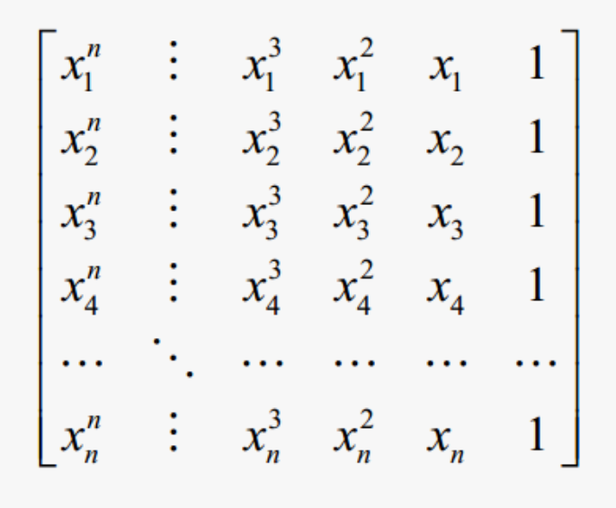

```
A=vander([1;2;3;5])

A =

 1     1     1     1

 8     4     2     1

27     9     3     1

125    25     5     1
```

(3)  希尔伯特矩阵

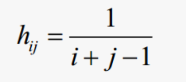

```
format rat%以有理形式输出
H=hilb(4),%生成4阶希尔伯特矩阵
H1=invhilb(4)%生成4阶希尔伯特逆矩阵

H =

   1              1/2            1/3            1/4     
   1/2            1/3            1/4            1/5     
   1/3            1/4            1/5            1/6     
   1/4            1/5            1/6            1/7     


H1 =

  16           -120            240           -140       
-120           1200          -2700           1680       
 240          -2700           6480          -4200       
-140           1680          -4200           2800    
```

### (4）帕斯卡矩阵

```
杨晖三角形组成的矩阵，二项式展开系数组成

pascal(5)%生成5阶帕斯卡矩阵

ans =

   1              1              1              1              1       
   1              2              3              4              5       
   1              3              6             10             15       
   1              4             10             20             35       
   1              5             15             35             70       
```

