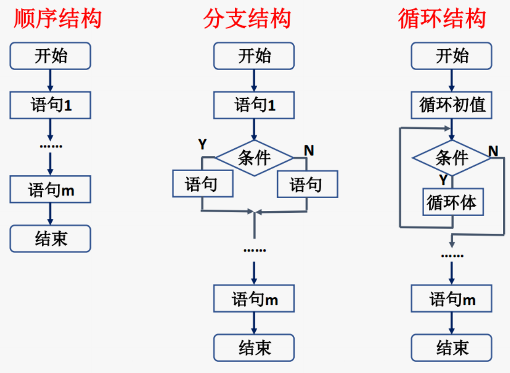

# MATLAB程序设计

## 一.函数M文件格式


**规则：1.第一行须以function为引导词，须遵循形式：**

**function<返回变量>=<函数名>(<输入变量>)**

**2.m文件的文件名最好为<函数名>.m**

**3.程序中变量均为局部变量，不保存在工作空间中，只在函数运行期间有效**

例题：请编写一个函数文件，求半径为r的圆的面积和周长。

```MATLAB
function[s,p]=fcircle(r)

​	s=pi*r*r;

​	p=2*pi*r;
end

[s,p]=fcircle(10)

​	s=314.1593

​	p=62.8319
```

|      | 命令文件         | 函数文件                  |
| ---- | ---------------- | ------------------------- |
| 参数 | 无输入无输出     | 可有输入可有输出          |
| 数据 | 全局变量         | 为局部变量,也可设全局变量 |
| 应用 | 一连串费时的指令 | 扩充函数库特殊的应用      |

## 二.输入与输出

### 输入——input 

提示用户从键盘输入数值、字符串、表达式并接受该输入。

格式一：

a=input('字符串')

n=input('How many apples');

将输出字符串，并等待键盘输入用户可以输入数字或表达式、也可以输入字符串（须用单引号括起来）按回车键结束，并将输入赋给变量a

格式二：

a=input('字符串', 's')

n=input('How many apples','s');

将输出字符串，并等待键盘输入用户可以输入任何内容，一律被当作字符串赋给变量a

### 输出--disp/fprintf

- 自由格式(disp)
- 格式化输出(fprintf)

要直接输出文字或是一数值，可使用disp，例如;

```matlab
temp=20;

disp(temp);

disp('helloworld');
```

格式化输出(fprintf)，用来控制输出数据及文字的格式。

| 类型         | 转换    | 详细信息                                                     |
| ------------ | ------- | ------------------------------------------------------------ |
| 有符号整数   | %d 或%i | 以10 为基数                                                  |
| 无符号整数   | %u      | 以10为基数                                                   |
| 无符号整数   | %o      | 以 8 为基数（八进制)                                         |
| 无符号整数   | %x      | 以 16 为基数（十六进制），小写字母  a-f                      |
| 无符号整数   | %X      | 与%x相同，大写字母 A-F                                       |
| 浮点数       | %f      | 定点记数法（使用精度操作符指定小数点后的位数。)              |
| 浮点数       | %e      | 指数记数法，例如  3.141593e+00（使用精度操作符指定小数点后的位数）。 |
| 浮点数       | %E      | 与 %e 相同，但为大写，例如  3.141593E+00（使用精度操作符指定小数点后的 位数)。 |
| 浮点数       | %g      | 更紧凑的 %e 或  %f，不带尾随零（使用精度操作符指定有效数字位数。) |
| 浮点数       | %G      | 更紧凑的 %E 或  %f，不带尾随零（使用精度操作符指定有效数字位数。) |
| 字符或字符串 | %c      | 单个字符                                                     |
| 字符或字符串 | %s      | 字符向量或字符串数组。输出文本的类型与  formatSpec 的类型相同。 |

### 暂停pause

强行停止程序可以用Ctrl+C命令来完成

## 三.程序结构



### 顺序结构

MATLAB所有语句执行皆按照顺序结构执行

### 分支结构

#### if语句

```
if 表达式

​	执行语句

end
```

```matlab
n=input('please input a number,n=');
if n<10  
	n
end
```

```
if 表达式

​	执行语句1

else

​	执行语句2

end

please input a number,n=5

n =

     5
```

```matlab
a=input('please input a number,a=');
b=input('please input a number,b=');
if a>b
	maxvalue=a;
else
	maxvalue=b;
end
	maxvalue
	
please input a number,a=5
please input a number,b=7

maxvalue =

     7
```

```matlab
if 表达式1
	语句1
elseif 表达式2
	语句2
elseif 表达式3
	语句3
...

else
	语句n
end
```

#### 相关操作符

关系:>,<,<=,>=,==,~=

逻辑:&,|,~

逻辑函数:

- isequal--若是相等则为真
- isempty--若为空则为真
- isstr--若是字符串则为真

#### switch语句

```
switch 测试表达式

​	case 常量1

​			语句组1

​	......

​	case 常量i

​			语句组i

​	......

​	otherwise 

​			语句组N

end
```

功能:首先判断测试表达式的值，当表达式的值与某一个常量相等时，就执行常量后面的语句，执行完后，程序直接跳出开关体，执行end后的语句。若与所有常量的值都不相等，则执行otherwise后面的语句
注意:语句中各个case后常量表达式的值须各不相同

```matlab
x=input('请输入一个数：');

switch rem(x,5)

​	case 0

​		disp('你输入的数可以被5整除');

​	otherwise 

​		disp('你输入的数不能被5整除');

end
```

### 循环结构

又称为重复结构，利用计算机计算速度快，以及能进行逻辑控制的特点来重复执行某些操作。

#### for —end

格式：

for 循环变量=表达式1：表达式2：表达式3  

​		可执行语句

end

其中：

表达式1：为循环初值；

表达式2：为循环步长

表达式3：循环终值

```matlab
a=zeros(4,3);
for i=1:4 
    for j=1:3
        a(i,j)=4+4*(j-1)+6*(i-1)
    end
end

a =

     4     8    12
    10    14    18
    16    20    24
    22    26    30
```

#### while—end

格式：

while 条件表达式

​			循环体语句

end

说明:
表达式一般是由逻辑运算和关系运算以及一般运算组成的，以判断循环的进行和停止
只要表达式的值非0，继续循环直到表达式值为0，循环停止

```matlab
msum=0;
n=0;
x=input('请输入一个数字（输入0将结束输入）：');
while x~=0
    msum=msum+x;
    n=n+1;
    x=input('请输入一个数字（输入0将结束输入）：');
end
if n>0 
    msum;
    mean=msum/n;
end
```

- while 语句多用于循环次数不确定的情况，而对于循环次数比较确定的情况用for语句更方便。
- 针对不同情况可以选择不同的循环语句，但从功能上讲两种循环语句可以相互替代。

#### break与continue语句

- break语句用来跳出循环体，结束整个循环。
- continue语句用来结束本次循环，接着进行下一次是否执行循环的判断。

```matlab
for n=100:200
    if rem(n,21) == 0
        disp(n);
    else 
        continue
    end
end


   105

   126

   147

   168

   189

```

#### try 语句

格式：

try 

​	语句组1

catch

​	语句组2

end

首先执行语句组1，如语句组1在执行过程中出现了错误，则将错误信息赋给lasterr变量，并转去执行语句组2。

```
A=[1 2 3;4 5 6];

B=[7 8 9;10 1112];

try

​	C=A*B;*

*catch*

​	C=A.*B;

end  

​	C

​	lasterr
```

## 四.函数

function [输出形参表]=函数名（输入形参表）

​			注释说明部分

​			函数体语句

当有多个形参时，形参之间用逗号分割，形成形参表。当输出形参多于1个时，应用方括号括起来构成一个输出矩阵。

当函数中有return语句时，表示结束函数的执行！

调用格式

[输出参数1,输出参数2,....]=函数名(输入参数1,输入参数2,....)

输出实参表                                      输入实参表

注意：

1、函数调用时各个参数顺序应与函数定义时顺序一致

2、函数调用可以进行嵌套，也可以递归

### 函数参数

nargin---调用该函数时输入参数数目

nargout--调用该函数时输出参数数目

函数文件中通过这两个变量，知道该函数文件被调用时的输入输出参数的个数。

2、当函数的输入和输出参数个数不确定时

varargin和varargout——传递任意数目的输入和输出参数

varargin两种使用情况

function myfun(varargin)

当调用函数时，varargin{1}接收函数的第1个输入，

​							varargin{2}接收函数的第2个输入......

function myfun(in1,in2,varargin)

当调用函数时，in1接收函数的第1个输入

​							in2接收函数的第2个输入

​							varargin{1}接收函数的第3个输入

​							varargin{2}接收函数的第4个输入......

```matlab
function varargout=addtest(a,b,varargin)
    if nargin==2
        varargout{1}=a+b;
    elseif nargin==3
        varargout{1}=a+b;
        varargout{2}=a+b-varargin{1};
    end
end

r=addtest(1,2)

r =

     3

[a,b]=addtest(1,2,3)

a =

     3
```

### 匿名函数

基本格式：函数句柄变量=@（匿名函数输入参数）匿名函数表达式

```matlab
f=@(x,y)x^2+y^2
f(3,4)
ans =

    25
```

### Matlab计时函数

**cputime：显示Matlab启动后所占用的CPU时间；**

t0=cputime;

Matlab程序;

t1=cputime-t0;%Matlab程序的运行时间

**tic,toc：秒表计时，tic开始，toc结束；**

tic;

Matlab程序;

t1=toc;%Matlab程序的运行时间

- cputime：显示Matlab启动后所占用的CPU时间；
- tic,toc：秒表计时，tic开始，toc结束；
- clock：clock显示系统时间
- etime:etime计算两次调用clock 之间的时间差。

### 子函数

- 函数文件中可以含有一个或多个子函数；
- 子函数由function语句引导；
- 主函数必须位于最前面，子函数出现的次序任意；
- 子函数只能被主函数和位于同一个函数文件中的其它子函数调用；
- 除了用global定义的全局变量外，子函数中的变量都是局部变量；
- 子函数与主函数及其它子函数之间通过输入、输出参数进行数据传递。

```matlab
function [avg, med] = main_fun(x) %主函数
    n =length(x);
    avg= sub_fun1(x, n);
    med = sub_fun2(x,n);
function a = sub_fun1(x,n)% 子函数1
    a =sum(x)/n;
function m = sub_fun2(x,n)% 子函数
    x =sort(x);
    if rem(n, 2) == 1
        m =x((n+1)/2);
    else
        m = (x(n/2)+x(n/2+1))/2;
    end
```

### 私有函数（Private Functions）

- 当开发大型应用软件时，包括大量的函数和子函数。按照调用层次分别放在父目录和子目录中。
- 例如父文件夹名为newmath，而子文件夹名为private。
- 存放在private文件夹中的函数就称为私有函数，只有那些在父文件夹中的函数才能调用这些私有函数。