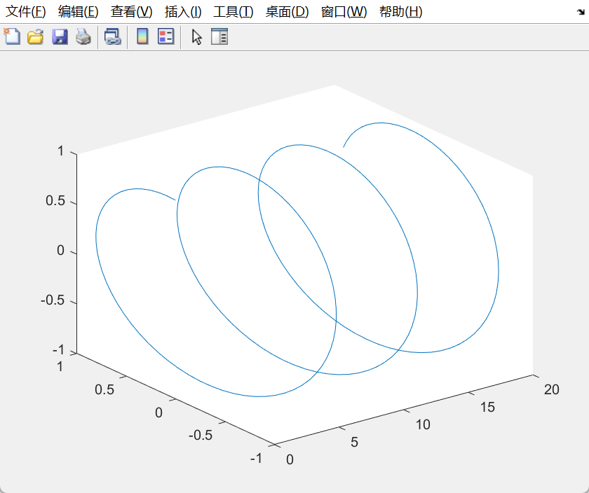
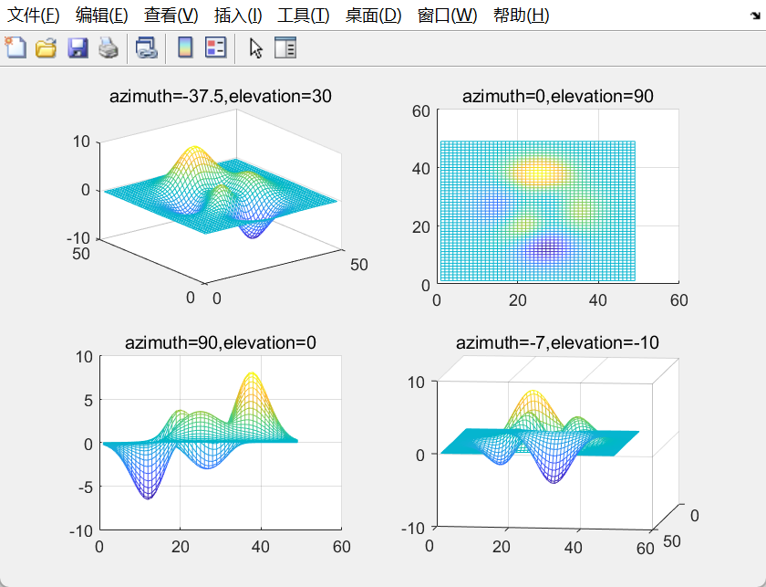

# MATLAB绘图

## 一.MATLAB绘图概论

```matlab
%给出离散点：

x=[0:pi/10:2*pi];

%计算函数值：

y=sin(x);

% 画图：用MATLAB二维绘图命令plot 作出函数图形

plot(x,y);
```


### %1.画点

```
x=[0:0.5:2*pi];

y=sin(x);

plot(x,y,'.');
```


### %2.连线

```
x=[0:0.5:2*pi];

y=sin(x);

plot(x,y,'g.-');
```


### %3.加密，取更多的点

```
x=[0:0.1:2*pi];

y=sin(x);

plot(x,y,'.');
```


### %4.先画点再连线

```
x=[0:0.1:2*pi];

y=sin(x);

plot(x,y,'.-');
```


### %5.画点连线

```
x=[0:0.1:2*pi];

y=sin(x);

plot(x,y);
```


### 总结

1、准备绘图数据：x=[0:pi/10:2*pi];y=sin(x);

2、调用绘图函数作出图形如：plot(x,y)

3、调用相关函数和命令调整图形特征，如：gridon

axis([-1,8,-2,2])

## 二.MATLAB二维绘图

```
x1=linspace(0,2*pi,100);

x2=linspace(0,3*pi,100);

x3=linspace(0,4*pi,100);

y1=sin(x1);

y2=1+sin(x2);

y3=2+sin(x3);

x=[x1;x2;x3]';

y=[y1;y2;y3]';

plot(x,y)
```


### %1.向量矩阵

```
x=[0,1];

y=[3,4,5;6,7,8];

plot(x,y,'*-');

title('x,y');
```


### %2.划分绘图区域

subplot(m,n,p);

```
x=-pi:pi/10:pi;

y1=sin(x);

y2=sin(2*x);

y3=sin(4*x);

y4=sin(8*x);;

subplot(2,2,1),plot(x,y1),title('sin(x)');

subplot(2,2,2),plot(x,y2),title('sin(2x)');

subplot(2,2,3),plot(x,y3),title('sin(4x)');

subplot(2,2,4),plot(x,y4),title('sin(8x)');
```


### %3.极坐标系

polar(theta,rho,选项)

其中theta为极坐标极角，rho为极坐标半径，选项的内容与plot函数相似。

```
t=0:pi/50:2*pi;

r=sin(t).*cos(t);

polar(t,r,'-*');

r=sin(t)*cos(t);
```


### %4.二维统计分析图

%bar(x,y,选项) 柱状图 条形图

% stairs (x,y,选项) 阶梯图

% stem (x,y,选项) 火柴杆图

% fill(x1,y1,选项1,x2,y2,选项2,...) %填充图

```
x=-pi:pi/10:2*pi;

y=2*sin(x);

subplot(2,2,1),bar(x,y,'g'),title('柱状图');

subplot(2,2,2),stairs(x,y,'b'),title('阶梯图');

subplot(2,2,3),stem(x,y,'k'),title('火柴杆图');

subplot(2,2,4),fill(x,y,'y'),title('填充图');
```


%pie(X) 饼图

% compass(Z) 向量图

```
subplot(1,2,1),pie([23,47,43,35]'),title('饼图');

subplot(1,2,2),compass([7+5.9i,4-3i,-5.5-6i]), title('向量图')
```


### %5.hold on 

在一个绘图区域内绘制多个函数的图像

```
x=-pi:pi/10:pi;

y1=sin(x);

y2=sin(2*x);

hold on;

plot(x,y1,'go-');

plot(x,y2,'r*-');
```


### %6.MATLAB图形标注

%plot(x,y,string)其中string 是用单引号括起来的字符串，用来指定图形的属性（点、线的形状及颜色）

```
x=[0:0.2:2*pi];

plot(x,cos(x));

plot(x,cos(x),'r+:');

plot(x,cos(x),'bd-.');

plot(x,cos(x),'k*-');
```

```
x=linspace(0,2*pi,30);

y=sin(x);

z=cos(x);

plot(x,y,'r--',x,z,'g-o');
```


### %7.标题title('text')

```
x=[0:0.2:2*pi];

y=sin(x);

plot(x,y);

title('y=sin(x)函数图像');
```


### %8.坐标轴标注

 xlabel('text')或ylabel('text')

```
x=[0:0.2:2*pi];

y=sin(x);

plot(x,y);

title('y=sin(x)函数图像');

xlabel('0:2pi');

ylabel('y=sin(x)');
```


### %9.添加图例

legend(string1,string2,string,...)

```
x=[0:0.2:2*pi];

y=sin(x);

plot(x,y);

title('y=sin(x)函数图像')

xlabel('0:2pi');

ylabel('y=sin(x)');

legend('sin(x)');
```


指定地方添加图例

```
x=[0:0.2:2*pi];
y=sin(x);
plot(x,y);
title('y=sin(x)函数图像')
xlabel('0:2pi');
ylabel('y=sin(x)')
legend('sin(x)')
text(pi,sin(pi),'\leftarrowy=sin(x)')
```


```
x = 0 : 0.01 : 4*pi;
y1 = sin(x);
y2 = cos(x);
y3 = 3*cos(x);
y4 = cos(x).*sin(x);
y5 = cos(x) + sin(x);
y6 = cos(x) -2*sin(x);
h1 = plot(x,y1,x,y2,x,y3);
hold on
h2 = plot(x,y4,x,y5,x,y6);
legend('sin(x)','cos(x)','3cos(x)','cos(x)*sin(x)','cos(x)+sin(x)','cos(x)-sin(x)')
```


### %10.显示网格

grid on 或grid off

### %11.保持当前窗口的图像

hold on 或hold off

### %12.新建绘图窗口

 figure(n)

```
x=[0:0.2:2*pi];

y=sin(x);

plot(x,y);

title('y=sin(x)函数图像')

xlabel('0:2pi');

ylabel('y=sin(x)')

legend('sin(x)')

text(pi,sin(pi),'\leftarrowy=sin(x)')

grid on

hold on

plot(x,y,x,cos(x));

legend('sin(x)','cos(x)')

figure

plot(x,cos(x))
```


### %13.线条的粗细，字体大小，坐标轴属性等

```
x=-pi:pi/10:pi;

y=sin(x);

plot(x,y,'rd:','linewidth',2,'markeredgecolor','b','markerfacecolor','k');
```


### %14.控制坐标轴的显示范围

axis([xmin,xmax,ymin,ymax])

```matlab
t=0:0.1:4*pi;

y=sin(t);

subplot(3,1,1),plot(t,y);

subplot(3,1,2),plot(t,y);

axis([0,max(t),min(y), max(y)]);

subplot(3,1,3),plot(t,y);

axis([0-0.1,max(t)+0.1,min(y)-0.2,max(y)+0.2]);
```


## 三.MATLAB绘制三维图形

### %1.三维曲线plot3

% 设三维曲线的参数方程为：x=x(t), y=y(t),z=z(t),则其图形可由下面的命令绘出。plot3(x,y,z,s)

```
t=[0:0.1:20];

x=t;y=sin(t);

z=cos(t);

plot3(x,y,z)
```



### %2.mesh网格图和surf曲面图

```
x=[-8:0.5:8];

y=[-8:0.5:8];

[X,Y]=meshgrid(x,y);

r=sqrt(X.^2+Y.^2)+0.01;

Z=sin(r)./r;

mesh(X,Y,Z)
```

```
[X,Y]=meshgrid(x,y);

r=sqrt(X.^2+Y.^2)+0.01;

Z=sin(r)./r;

surf(X,Y,Z)


```


### %3.peaks峰值函数

有两个变量的一个函数，由平移和放缩高斯分布函数获得。

```
subplot(2,2,1);

mesh(peaks);

view(-37.5,30);

title('azimuth=-37.5,elevation=30')

subplot(2,2,2);

mesh(peaks);

view(0,90);

title('azimuth=0,elevation=90')

subplot(2,2,3); 

mesh(peaks);

view(90,0);

title('azimuth=90,elevation=0')

subplot(2,2,4); mesh(peaks);view(-7,-10);

title('azimuth=-7,elevation=-10');
```


## 四.图像精细化处理


### %1.视点函数

```
subplot(2,2,1);
mesh(peaks);
view(-37.5,30);
%指定子图1视点
title('azimuth=-37.5,elevation=30')
subplot(2,2,3);
mesh(peaks);view(90,0);
%指定子图3视点
title('azimuth=90,elevation=0')
subplot(2,2,2);
mesh(peaks);
view(0,90);
%指定子图2视点
title('azimuth=0,elevation=90')
subplot(2,2,4); 
mesh(peaks);
view(-7,-10);
%指定子图4视点
title('azimuth=-7,elevation=-10')
```



### %2.图像的色彩处理


```
x=[0:pi/20:2*pi];

y=sin(x);

plot(x,y,'color',[1 0 0]);
```


### %3.设置图形窗口色图

```
surf(peaks);

colormap(autumn);

title('红黄浓淡色')
```


```
surf(peaks);

colormap(prism);

title(‘光谱交错色')
```


### %4.打开或关闭隐藏线条删除

```
hidden on/off  

p=peaks(30);

mesh(p);

colormap(jet);

hidden off
```


### %5.图形的剪裁

```
p=peaks;

p(30:40,20:30)=NaN*p(30:40,20:30)

mesh(p)
```


```
surf(p)
```


