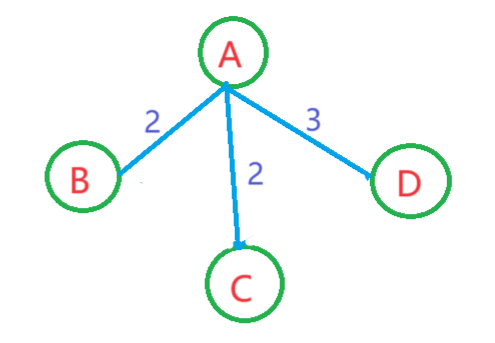

# 最小生成树--Prim算法

## 一.算法介绍

最小生成树是图论中重要的问题之一，它在许多实际应用中都具有重要意义。除了Kruskal算法外,Prim算法也是一种用于求解最小生成树的经典算法之一。与Kruskal算法不同，Prim算法是一种顶点驱动的方法，而不是边驱动的方法。对比前者,此算法更适合边较为稠密的图。

这里博主自己理解的，对比Kruskal算法那种一维添加边的方式，Prim更像是对二维面上的数进行扩充。从一个初始顶点开始，逐步扩展生成最小生成树的集合，直到包含了图中的所有顶点。像是将树所在的平面里,一个二维平面不断扩充的过程。本文将介绍Prim算法的基本原理和步骤，以及一些应用场景和优化技巧。

首先，同样让我们来了解一下最小生成树的概念。给定一个连通图，最小生成树是指该图上所有的顶点都被连接起来，并且总权值最小的树。权值可以代表距离、成本或其他度量指标，根据具体问题的不同而定。

Prim算法的基本思想是从一个顶点开始，逐步构建最小生成树。具体步骤如下：

1. 随机选取一个顶点作为起始点，并将其加入最小生成树的集合中。
2. 从该顶点出发，选择一条边连接到其他未被访问的顶点中的最小权值边。
3. 将该顶点加入到最小生成树的集合中，并标记为已访问。
4. 重复步骤2和步骤3，直到最小生成树包含所有顶点。

Prim算法的时间复杂度为O(V^2)，其中V为顶点的数量。在稀疏图中，可以通过使用优先队列（堆）来将时间复杂度优化到O(ElogV)，其中E表示边的数量。

## 二.算法讲解

接下来我们结合一个简单的具体实例来讲解,例子来源于:洛谷P3366最小生成树


我们从A顶点开始。将A加入最小生成树，把A的`key`值设为0，把其所有邻居的`key`值设为对应边的权重，即B的`key`值设为2，C的`key`值设为2，D的`key`值设为3。此外，`mstSet`数组用于记录每个顶点是否已经被加入了最小生成树，初始化所有元素为`false`。`parent`负责存储父节点,因为所有暂时都没有所以为-1。

```
key   = [0, 2, 2, 3]
mstSet= [true, false, false, false]
parent= [-1, -1, -1, -1]
```

此时的树包括


接着从所有未加入最小生成树的顶点中，选择一个到最小生成树距离最小的顶点。这里是B，因为B的`key`值最小。

将B加入最小生成树中，把`mstSet[B]`值设为`true`。对于每个邻居顶点，如果该顶点没有被加入最小生成树（即`mstSet[neighbor]`为false），我们需要判断是否需要更新该顶点的`key`值。如果从顶点B到该邻居顶点的边的权重值小于目前邻居顶点的`key`值，我们需要将邻居顶点的`key`值更新为从顶点B到该邻居顶点的边的权重值。就是如果B到C的权重为1,那么要更新数组的值。

```
key   = [0, 2, 2, 3]
mstSet= [true, true, false, false]
parent= [-1, 0, -1, -1]
```

那么此时就确定了两个点，AB


反复执行步骤2和步骤3，直到所有顶点都加入了最小生成树。下一步选择C，因为C的`key`值最小。而B已经加入到图中了。

```
key   = [0, 2, 2, 3]
mstSet= [true, true, true, false]
parent= [-1, 0, 0, -1]
```

此时的图就已经包括ABC


最后我们遍历最后D点,权重为3加入图中,并将false改为true

```
key   = [0, 2, 2, 3]
mstSet= [true, true, true, true]
parent= [-1, 0, 0, 0]
```

那么我们最后的树的连接为:



这里要补充个选择设定,A到D的权重和C到D的权重相等,那Prim为啥选择A到D?

Prim算法在选择下一个顶点加入最小生成树时，是根据顶点到最小生成树的距离（即`key`值）进行选择的。如果在当前步骤中，顶点A和顶点C的`key`值相等，那么选择哪个顶点加入最小生成树是没有特定规定的，可以根据具体实现的条件来选择。

一种常见的选择策略是按照某种规则来确定，比如按照顶点的字典序进行选择，即选择字母较小的顶点。在这种情况下，如果选择了顶点A加入最小生成树，那么在后续的步骤中，可能会选择顶点A到顶点D的边，而不是顶点C到顶点D的边。这样可以确保算法的一致性和确定性，即相同的输入应该得到相同的输出。

需要注意的是，无论选择顶点A还是顶点C加入最小生成树，最终得到的最小生成树的权重是相同的，只是顶点的选择可能会有所不同。选择哪个顶点加入最小生成树可能会影响最终生成树的形状和结构，但不会影响最小生成树的权重。

## 三.代码实现

C++较为繁琐,后续会将一些优化。

```C++
#include <iostream>
#include <climits>

#define V 4

// 找到key数组中的最小值
int minKey(int key[], bool mstSet[])
{
    int min = INT_MAX, min_index;

    // 遍历所有顶点
    for (int v = 0; v < V; v++)
    {
        // 如果顶点尚未加入最小生成树，且与当前顶点的权重较小
        if (mstSet[v] == false && key[v] < min)
        {
            min = key[v];
            min_index = v;
        }
    }

    return min_index;
}

// 打印最小生成树的结果
void printMST(int parent[], int graph[V][V])
{
    std::cout << "Edge \tWeight\n";
    for (int i = 1; i < V; i++)
    {
        std::cout << parent[i] << " - " << i << "\t" << graph[i][parent[i]] << "\n";
    }
}

// 执行Prim算法构造最小生成树
void primMST(int graph[V][V])
{
    int parent[V];     // 用于记录每个顶点的父节点
    int key[V];        // 用于记录每个顶点与最小生成树的最小权重
    bool mstSet[V];    // 记录每个顶点是否已经加入最小生成树

    // 初始化所有顶点的key和mstSet数组
    for (int i = 0; i < V; i++)
    {
        key[i] = INT_MAX;
        mstSet[i] = false;
    }

    key[0] = 0;         // 设置起始顶点的key为0，即A顶点
    parent[0] = -1;     // 设置起始顶点的父节点为-1，表示没有父节点

    // 依次加入V-1个顶点到最小生成树中
    for (int count = 0; count < V - 1; count++)
    {
        int u = minKey(key, mstSet);    // 选择一个key值最小的顶点
        mstSet[u] = true;               // 将该顶点标记为已加入最小生成树

        // 更新与u相邻的顶点的key值和父节点
        for (int v = 0; v < V; v++)
        {
            // 如果v与u相邻，且v尚未加入最小生成树，且与u的权重较小
            if (graph[u][v] && mstSet[v] == false && graph[u][v] < key[v])
            {
                parent[v] = u;    // 更新v的父节点为u
                key[v] = graph[u][v];    // 更新v与最小生成树的最小权重为与u的边的权重
            }
        }
    }

    printMST(parent, graph);    // 打印最小生成树的结果
}

int main()
{
    int graph[V][V] = { {0, 2, 2, 3},
                        {2, 0, 4, 0},
                        {2, 4, 0, 3},
                        {3, 0, 3, 0} };

    primMST(graph);    // 执行Prim算法构造最小生成树

    return 0;
}
```

Python：

```python
import sys


def minKey(key, mstSet):
    min = sys.maxsize
    min_index = 0

    for v in range(len(key)):
        if mstSet[v] == False and key[v] < min:
            min = key[v]
            min_index = v

    return min_index


def printMST(parent, graph):
    print("Edge \tWeight")
    for i in range(1, len(parent)):
        print(parent[i], "-", i, "\t", graph[i][parent[i]])


def primMST(graph):
    V = len(graph)
    parent = [0] * V
    key = [sys.maxsize] * V
    mstSet = [False] * V

    key[0] = 0
    parent[0] = -1

    for _ in range(V - 1):
        u = minKey(key, mstSet)
        mstSet[u] = True

        for v in range(len(graph)):
            if graph[u][v] and mstSet[v] == False and graph[u][v] < key[v]:
                parent[v] = u
                key[v] = graph[u][v]

    printMST(parent, graph)


graph = [[0, 2, 2, 3],
         [2, 0, 4, 0],
         [2, 4, 0, 3],
         [3, 0, 3, 0]]

primMST(graph)
```

java:

```java
import java.util.Arrays;

public class PrimMST {

    // 获取未包含在最小生成树中的最小键值顶点的下标
    static int minKey(int[] key, boolean[] mstSet) {
        int min = Integer.MAX_VALUE;
        int min_index = 0;

        for (int v = 0; v < key.length; v++) {
            if (!mstSet[v] && key[v] < min) {
                min = key[v];
                min_index = v;
            }
        }

        return min_index;
    }

    static void printMST(int[] parent, int[][] graph) {
        System.out.println("Edge \tWeight");
        for (int i = 1; i < parent.length; i++) {
            System.out.println(parent[i] + " - " + i + " \t" + graph[i][parent[i]]);
        }
    }

    static void primMST(int[][] graph) {
        int V = graph.length;
        int[] parent = new int[V];
        int[] key = new int[V];
        boolean[] mstSet = new boolean[V];

        Arrays.fill(key, Integer.MAX_VALUE); // 填充键值数组为最大值
        Arrays.fill(mstSet, false); // 初始化所有顶点为未包含在最小生成树中

        key[0] = 0; // 从第一个顶点开始构建最小生成树
        parent[0] = -1;

        for (int count = 0; count < V - 1; count++) { // 最小生成树的边数为V-1
            int u = minKey(key, mstSet); // 获取最小键值顶点
            mstSet[u] = true; // 将该顶点标记为已包含在最小生成树中

            for (int v = 0; v < V; v++) {
                if (graph[u][v] != 0 && !mstSet[v] && graph[u][v] < key[v]) {
                    parent[v] = u;
                    key[v] = graph[u][v];
                }
            }
        }

        printMST(parent, graph);
    }

    public static void main(String[] args) {
        int graph[][] = new int[][]{
                {0, 2, 2, 3},
                {2, 0, 4, 0},
                {2, 4, 0, 3},
                {3, 0, 3, 0}
        };

        primMST(graph);
    }
}
```


## 四.算法优点

最后我们可以看出Prim算法具有以下几个优点：

1. 算法简单，易于理解和实现。
2. 对于稀疏图来说，算法的性能较好。
3. 可以处理带权的图，并且可以根据具体问题选择适当的权值度量指标。
4. Prim算法的结果是唯一的。

在实际应用中，Prim算法可以用于解决许多场景，例如网络设计、通信网络建设、电力传输以及城市规划等。在这些场景中，选择最小生成树可以有效降低成本，并优化资源分配。

总结起来，Prim算法是一种用于解决最小生成树问题的经典算法。它基于贪心策略，从一个顶点开始，逐步构建最小生成树。通过选择权值最小的边，将未访问的顶点逐步加入到最小生成树中，最终得到最小生成树的结果。

除了基本的Prim算法，还有一些优化技巧可以提高算法的效率，下面我们介绍一些比较常用的优化方法。

## 五.算法优化

1. 堆优化

在Prim算法中，每次从未访问的顶点中选择最小权值边需要对所有未访问的顶点进行一次遍历，时间复杂度为O(V)，这对于稀疏图来说是可以接受的，但对于密集图来说可能会导致性能瓶颈。

因此，我们可以使用优先队列（堆）来优化算法。每次从堆中取出权值最小的边，将其连接的顶点标记为已访问，并将其加入到最小生成树中。对于每个未访问的顶点，我们都将它与堆中最小的边进行比较，这样可以降低时间复杂度，最终将时间复杂度降至O(ElogV)。

2. 稠密图优化

如果Prim算法被应用于稠密图上，堆优化的效果不佳，因为堆在稠密图中会很大，导致堆操作消耗大量时间和空间。在这种情况下，我们可以采用邻接矩阵的方式存储图，将每个顶点与其相邻的顶点的权值记录在矩阵中，这样可以将Prim算法的时间复杂度优化到O(V^2)，这对于稠密图来说是最优的。

3. 使用Prim算法解决带有限制的问题

在某些情况下，我们需要在图上找到一个权值不超过特定值的最小生成树。如果我们直接使用Prim算法，可能会得到一棵权值超过限制的最小生成树。

为了解决这个问题，我们可以采用限制集合的方式来对Prim算法进行优化。即在执行算法时，同时维护一个限制集合，每次对访问的顶点进行限制判断，如果该顶点与已经加入最小生成树中的边的集合中的边构成的图是一个无环图，并且权值不超过特定值，那么我们才将该顶点加入最小生成树中。这样可以保证得到的最小生成树满足限制条件。

## 六.总结

Prim算法是一种常用的解决最小生成树问题的算法，通过简单的贪心策略，可以找到连接所有顶点并且总权值最小的树。我们可以采用堆优化、稠密图优化和限制集合优化等技巧来提高算法的效率，并解决一些带有限制的问题。在实际应用中，可以根据具体问题的不同选择合适的优化技巧，来得到更好的算法性能和解决方案。