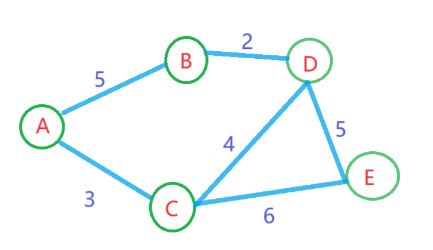
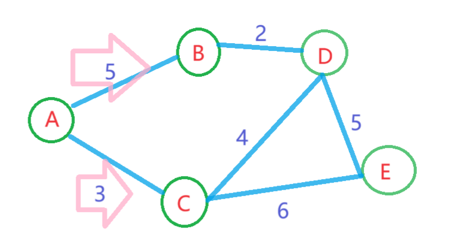
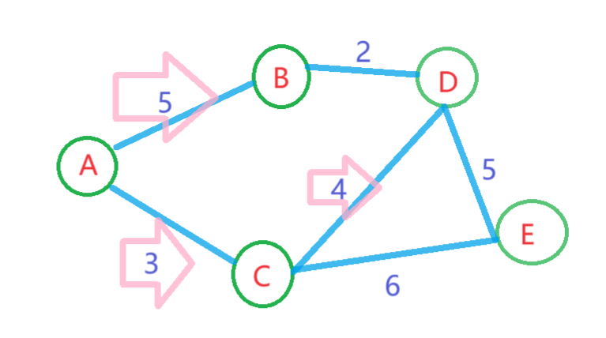
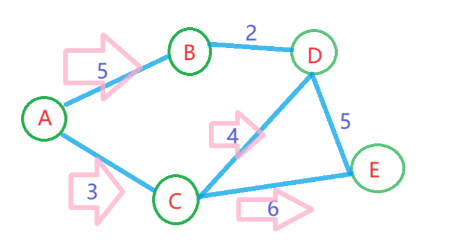

# 最短路径问题--Dijkstra算法

## 一.最短路径问题介绍

距离最短路径是指在图或网络中从一个源节点到目标节点的最短路径。在实际应用中，例如路线规划、电话网络、电力网络、计算机网络等领域，我们常常需要使用最短路径算法来计算节点之间的最短距离，从而优化系统的效率和性能。

最短路径问题可以通过图论算法来解决。其中，Dijkstra算法是一种常用和经典的最短路径算法，可以在有向和无环的加权图中计算从源节点到其它各个节点的最短路径。Dijkstra算法不使用任何距离估计，它通过逐个计算最短路径来达到目的。但是需要注意的是此算法要求每条路径上的权重,或者距离非0。除此之外的问题可以由别的算法解决如：贝尔曼-福特算法，弗洛伊德算法等，这里不多赘述。

## 二.Dijkstra算法介绍

Dijkstra算法通过不断地更新节点之间的最短距离和路径，来逐步确定最短路径。它的基本思想是从起始节点开始，依次访问与当前节点相邻的节点，通过松弛操作更新节点之间的距离，直到找到最短路径。

最短路径算法中，Dijkstra算法是一种贪心算法。它用于解决单源最短路径问题，即从单一源点出发到其他所有顶点的最短路径问题。Dijkstra算法的核心思想是贪心选择，它通过不断地选择离源点最近的未访问顶点，并更新其他顶点到源点的最短路径，最终得到从源点到所有顶点的最短路径。

此算法有着三个重要的数据结构：距离数组dist，用于记录源点到其他各顶点的最短路径长度；前驱数组prev，用于记录到达各顶点的最短路径中的前一个顶点；访问标记数组，用于标记某个顶点是否被加入到最短路径树中。可以理解为你到目的地的站点,此站点为最近。算法的基本步骤是：首先将源点加入最短路径树，然后循环选择离源点最近的未访问顶点，并将其加入最短路径树，同时更新其他顶点的最短路径长度和前驱顶点。当所有顶点都被访问过时，算法结束。其在解决单源最短路径问题时具有较高的效率，时间复杂度为O((V+E)logV)，其中V和E分别为顶点数和边数。

## 三.Dijkstra算法实现过程

此算法配以动图是最好理解的，这里推荐大家个bilibili视频：

【【算法】最短路径查找—Dijkstra算法】 https://www.bilibili.com/video/BV1zz4y1m7Nq/?share_source=copy_web&vd_source=a99a6abc406cf4968ddb5c1b363abc55

那么我就以一个简单例子文字加图片的方式阐述下算法思想，用于以后复习和理解

对于这样一个路径，我们要找到从A到E的最短路径。




1.首先，我们创建一个节点数组来存储每个节点的最短路径和前驱节点信息，将A节点的最短路径标记为0，其他节点的最短路径标记为无穷大∞。

| Node | Shortest Distance | Predecessor |
| ---- | ----------------- | ----------- |
| A    | 0                 | null        |
| B    | ∞                 | null        |
| C    | ∞                 | null        |
| D    | ∞                 | null        |
| E    | ∞                 | null        |


2.接下来，我们从未被访问的节点中选择具有最小最短路径值的节点，将其标记为已访问，并更新其相邻节点的最短路径值。在这里，我们从节点A开始，因为它的最短路径为0。



| Node | Shortest Distance | Predecessor |
| ---- | ----------------- | ----------- |
| A    | 0                 | null        |
| B    | 5                 | A           |
| C    | 3                 | A           |
| D    | ∞                 | null        |
| E    | ∞                 | null        |

在上述表格中，我们更新了节点B和节点C的最短路径。

3.接下来，我们再次从未被访问的节点中选择具有最小最短路径值的节点，将其标记为已访问，并更新其相邻节点的最短路径值。现在节点C具有最小最短路径值。那就从C开始寻找其余点的最短路径。



| Node | Shortest Distance | Predecessor |
| ---- | ----------------- | ----------- |
| A    | 0                 | null        |
| B    | 5                 | A           |
| C    | 3                 | A           |
| D    | 7                 | C           |
| E    | ∞                 | null        |

在上述表格中，我们更新了节点D的最短路径值。

4.再次进行上述步骤，此时节点E具有最小的最短路径值，我们将其标记为已访问，并更新其相邻节点的最短路径值。



| Node | Shortest Distance | Predecessor |
| ---- | ----------------- | ----------- |
| A    | 0                 | null        |
| B    | 5                 | A           |
| C    | 3                 | A           |
| D    | 7                 | C           |
| E    | 9                 | C           |

根据我们的表格，从节点A到节点E的最短路径为A -> C -> E，其长度为3 + 6 = 9。因此，我们可以从节点A到节点C，再从节点C到节点E，跨越了一条边，则可以更短地到达节点E。

从整个算法看,就是寻找从A到其余点的最短距离,方法就是与原本存储的距离相比较,如果比原本小就更新最短,从而到达最终的目的地。

接下来我们使用代码实现下上述案例

```Python
import heapq  # 导入heapq模块，用于实现优先队列

def dijkstra(graph, start):
    dist = {node: float('inf') for node in graph}  # 初始化一个字典，用于存储每个节点的最短路径长度，初始值都设置为无穷大
    dist[start] = 0  # 设置起点到自身的最短路径长度为0
    pq = [(0, start)]  # 初始化优先队列，存储已经访问过的节点及其距离，(距离， 节点)

    while pq:  # 当优先队列不为空时，执行循环
        current_dist, current_node = heapq.heappop(pq)  # 弹出距离最小的节点
        for neighbor, weight in graph[current_node].items():  # 遍历当前节点的邻居
            distance = current_dist + weight  # 计算从起点到邻居的距离
            if distance < dist[neighbor]:  # 如果这个距离小于已知的最短距离
                dist[neighbor] = distance  # 更新最短距离
                heapq.heappush(pq, (distance, neighbor))  # 将新的最短距离和对应的节点加入到优先队列中
```

这里就是实现从A到任一点的最近距离.比如到D的为7,而到E的就是9,看下效果。

```
{'A': 0, 'B': 5, 'C': 3, 'D': 7, 'E': 9}
```

先具体介绍下核心部分:

```Python
current_dist, current_node = heapq.heappop(pq)
```

这一行代码从优先队列pq中取出距离最小的节点，即current_node，并把这个节点的距离current_dist也取出。heapq.heappop函数会弹出优先队列中最小的元素，也就是距离源点最近的节点。
这样，我们就可以遍历这个节点的邻居，计算从源点到这些邻居的距离，并更新最短路径长度。这个过程在循环中不断进行，直到所有的节点都被访问过。

```python
for neighbor, weight in graph[current_node].items():
```

这一行代码是在遍历当前节点（current_node）的邻居节点。在Python中，items()方法用于返回一个字典中的所有键值对。在这里，graph[current_node]是一个字典，表示当前节点的邻居节点及其权重。neighbor和weight是两个临时变量，分别表示邻居节点和对应的权重。

```Python
distance = current_dist + weight
```

计算从起点到邻居节点的距离。current_dist表示从起点到当前节点的距离，weight表示当前节点到邻居节点的权重。将这两个值相加，就可以得到从起点到邻居节点的距离。

```Python
if distance < dist[neighbor]:
  dist[neighbor] = distance
  heapq.heappush(pq, (distance, neighbor))
```

判断计算出的距离是否小于已知的最短距离。如果是，就更新最短距离，并将新的最短距离和对应的节点加入到优先队列中。

以上其实核心就已经结束了,那我们像看到具体路线怎么办,就需要实现个显示路径的函数。

完整代码就是：

```Python
import heapq


def dijkstra(graph, start):
    dist = {node: float('inf') for node in graph}
    dist[start] = 0
    pq = [(0, start)]
    prev = {}

    while pq:
        current_dist, current_node = heapq.heappop(pq)
        for neighbor, weight in graph[current_node].items():
            distance = current_dist + weight
            if distance < dist[neighbor]:
                dist[neighbor] = distance
                heapq.heappush(pq, (distance, neighbor))
                prev[neighbor] = current_node

    return dist, prev


def shortest_path(graph, start, end):
    distances, prev = dijkstra(graph, start)

    path = []
    current_node = end
    while current_node != start:
        path.insert(0, current_node)
        current_node = prev[current_node]
    path.insert(0, start)

    return distances[end], path


if __name__ == '__main__':
    graph = {
        'A': {'B': 5, 'C': 3},
        'B': {'D': 2},
        'C': {'D': 4, 'E': 6},
        'D': {'E': 5},
        'E': {}
    }

    start_node = 'A'
    end_node = 'E'
    distance, path = shortest_path(graph, start_node, end_node)

    print(f"最短 {start_node} 到 {end_node} 是:")
    print(" -> ".join(path))
```

结果为

```Python
最短 A 到 E 是:
A -> C -> E
```

补充一下，讲解的时候以有向图为例讲解的，无向图可以当有向图来处理，有向图就不能当无向图处理，本文例子是有向图便于讲解。

完结撒花✿✿ヽ(°▽°)ノ✿