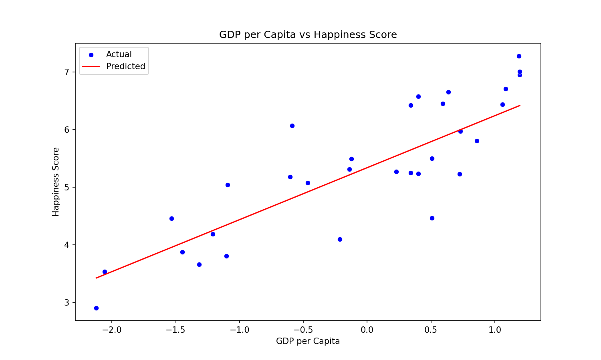

# 一篇带你入门机器学习--线性回归

前言:

好久没有更新了，新开一个专栏，专门讲述博主在学习机器学习中所遇到的一些练习和经验在这里分享出来。

现在我有一个数据集，是关于每个国家幸福指数得分和该国家各种指标的一个表格。其中的内容包括:

- Country: 国家名称
- Happiness.Rank: 幸福指数排名
- Happiness.Score: 幸福指数得分
- Whisker.high 和 Whisker.low: 幸福指数得分的高估和低估范围
- Economy..GDP.per.Capita.: 人均GDP
- Family, Health..Life.Expectancy., Freedom, Generosity, Trust..Government.Corruption.: 其他影响幸福指数的因素
- Dystopia.Residual: 用于计算幸福指数的残差项

而我现在要探索某些指标之间的关系。首先是探索单一变量各个国家人均GDP与幸福指数分数的关系。

## 一.单一变量算法思路:

对于单一不复杂的变量可以用以下思路：

1. 数据导入： 使用 pandas 库的 read_csv 函数从CSV文件中加载数据。
2. 数据准备：从数据集中提取用于建模的列。这里，我们使用人均GDP（Economy..GDP.per.Capita.）作为自变量 X，幸福指数得分（Happiness.Score）作为因变量 y。
3. 数据分割：使用 train_test_split 函数将数据集分割为训练集和测试集。这里，测试集的大小被设为20%（test_size=0.2），并且设置了随机状态（random_state=42）以确保可重复性。
4. 模型创建与训练：创建一个线性回归模型 model。使用训练集数据（x_train 和 y_train）来训练这个模型。
5. 模型预测：使用训练好的模型对测试集进行预测，得到预测的幸福指数得分 y_pred。
6. 模型评估：使用 mean_squared_error 函数计算均方误差（MSE），评估模型的预测误差。使用 r2_score 函数计算R^2分数，评估模型的拟合优度。
7. 数据可视化:使用 matplotlib 和 seaborn 库绘制散点图和回归线，可视化人均GDP与幸福指数得分之间的关系。
8. 结果输出：打印出均方误差（MSE）和R^2分数。

## 二.单一变量训练原理：

线性回归模型默认使用的是最小二乘法来求解模型参数，在线性回归中，我们试图找到一条直线（或更高维的超平面），这条直线能够最好地拟合数据。
假设我们有一个线性模型:
$$
y=Xβ+ϵ
$$
其中：

- y是一个n × 1的向量，表示实际观测值。
- X是一个n × k的矩阵，表示特征值，每一行对应一个观测样本，每一列对应一个特征。
- β是一个k ×1的向量，表示模型参数。
- ϵ是一个n×1的向量，表示误差项。

我们的目标是找到参数 β，使得预测值y=Xβ+ϵ与实际观测值 y 之间的差异（即残差）的平方和最小。数学上，这可以表示为最小化以下损失函数（即残差平方和）：
$$
S(\beta) = \sum_{i=1}^{n} (y_i - \hat{y}_i)^2 = (y - X \beta)^T (y - X \beta)
$$
其中 T 表示转置。
为了找到使 S(β) 最小的 β我们可以对 S(β) 求导，并令导数等于零。这样我们可以得到 β 的解析解：
$$
\beta = (X^T X)^{-1} X^T y
$$
这个解是封闭形式的，意味着我们可以直接计算得到参数 β。最小二乘法的优点是计算效率高，特别是当特征数量相对较小，且数据可以放入内存中时。


## 三.误差指标:

在机器学习中，均方误差（Mean Squared Error, MSE）和 R^2是两个常用的评估指标，用于衡量模型的性能。

### 1.均方误差（MSE）：

- 定义：均方误差是模型预测值与实际观测值之间差异的平均平方。

- 公式：
  $$
  MSE = \frac{1}{n} \sum_{i=1}^{n} (y_i - \hat{y}_i)^2
  $$

- 解释：MSE 越小，表示模型的预测值与实际值越接近，即模型性能越好。

### 2.R^2(确定系数）:

- 定义:是衡量模型拟合优度的指标，表示模型解释的变异占因变量总变异的比例。

- 公式：
  $$
  R^2 = 1 - \frac{\text{RSS}}{\text{TSS}}
  $$

- 其中 RSS 是残差平方和（Residual Sum of Squares），TSS 是总平方和（Total Sum of Squares）。

- 解释：值介于 0 和 1 之间，越接近 1 表示模型拟合效果越好。

## 四.详细代码:

```python
import pandas as pd
import numpy as np
from sklearn.linear_model import LinearRegression
from sklearn.model_selection import train_test_split
from sklearn.metrics import mean_squared_error, r2_score
import matplotlib.pyplot as plt
import seaborn as sns

# 数据加载
data = pd.read_csv('world-happiness-report-2017.csv')

# 数据初始化和预处理
# 处理缺失值
data = data.dropna()  # 删除含有缺失值的行

# 标准化或归一化某些特征
data['Economy..GDP.per.Capita.'] = (data['Economy..GDP.per.Capita.'] - data['Economy..GDP.per.Capita.'].mean()) / data[
    'Economy..GDP.per.Capita.'].std()

# 提取相关列
X = data[['Economy..GDP.per.Capita.']]
y = data['Happiness.Score']

# 数据分割
X_train, X_test, y_train, y_test = train_test_split(X, y, test_size=0.2, random_state=42)

# 模型创建与训练
model = LinearRegression()
model.fit(X_train, y_train)

# 模型预测
y_pred = model.predict(X_test)

# 模型评估
mse = mean_squared_error(y_test, y_pred)
r2 = r2_score(y_test, y_pred)

# 数据可视化
plt.figure(figsize=(10, 6))
sns.scatterplot(x=X_test['Economy..GDP.per.Capita.'], y=y_test, color='blue', label='Actual')
sns.lineplot(x=X_test['Economy..GDP.per.Capita.'], y=y_pred, color='red', label='Predicted')
plt.title('GDP per Capita vs Happiness Score')
plt.xlabel('GDP per Capita')
plt.ylabel('Happiness Score')
plt.legend()
plt.show()

# 结果输出
print(mse, r2)

```

那么我们就可以看到训练后得到的曲线与剩余的真实数据即测试集的关系:



从上图可以看出，随着人均GDP的增加，幸福指数得分也呈现出增加的趋势。线性回归模型的预测线（红色）较好地拟合了实际数据（蓝色点）。
此外，我们计算了以下评估指标：

- 均方误差（MSE）：0.3654
- R^2分数：0.7187

R^2分数接近于1，说明模型对数据的拟合程度较好。均方误差则表示预测值与实际值之间的偏差，其值越小，表示模型的预测越准确。
人均GDP与幸福指数之间存在正相关关系，且我们的线性回归模型较好地捕捉了这一关系。

